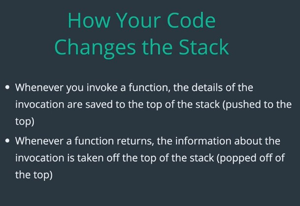
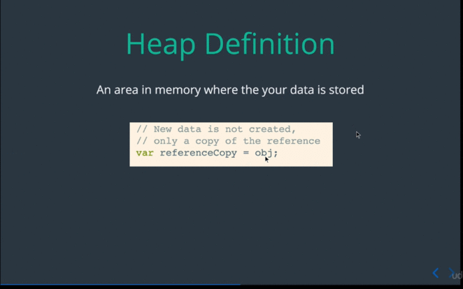

##  OBJECTIVE

###  1. Describe stack

* an ordered data structure
* keeps track of function invocations
* part of the JavaScript run-time (you don't access it directly)

#### How Your Code Changes the Stack

#### Stack Example

Lets see the Stack in action. lets take a look a small piece of code we examined
how the stack changes as the code as run.

The function is invoke below with parameters **3** and **5** so your result will
be **15**, but how JavaScript interact with stack when code runs? Well before
anything is execute it the JavaScript run-time will place the main program on
the stack.

So as you can see our stack first have has a main, I put line numbers on the side
of the code. The stack is keep in track here of the line that they were on, in
our main function, so that's important to know where you invoking the function
and where you need to return to after you done. So will see that as we go.

So what happen next, well multiply has been invoke this point on line number
**5**, so because **multipy()** has been invoke, The JavaScript run-time will
place the **muiltply** invocation on the stack.

So now the stack has another invocation on top of **main** invocation. So our
previous invocation for the main, is waiting on line number **5** for the result
of **multiply** function finish, and **mutiply** here is on line number **2**
about to execute the code for **x** times **y** in other words **3** times
**5**, and then we will return that from our **mulitply()** function.

So now **multiply** function all done, which mean that we gonna **pop-out**
multiply out of the stack, once we return something our function is finish,
 JavaScript run-time can take off out the stack.

Now because our **main** function was waiting here on line number **5** the
result calling multiply comes back to our **main** on line **5**, so now the
result is equal to **15**.

But we were not quit done yet, remember that, our **main** function is still on
stack, so once we assign the result of **15** our code is all done, so the
JavaScript run-time takes **main** out off the stack as well.

So now our stack is empty,  we're not running any more code, and JavaScript
run-time wait something to do.

Lets go back off a bit, to the example we have a view things on the stack. So
here we are we got our **main** function right here and we invoke to
**multiply**, so we've got two invocation on the stack.

What of this boxes keep track this function invocation, is often called
**Stack-Frame**, and keep track some pretty important information.

#### Stack Frame Content

So what **Stack Frame** have, it has information about the function that was
invoked, is you can see here this our **main** function that getting invoke, and
this is **multipy** function.

It has the parameter that was pass to the function, I'm not keeping track right
here, but we remember that **mulitply** in this example was pass **3** and **5**
for **x** and **y**.

And also very important we keep track the line number that we were on, So when
this **multiply** finished JavaScript knows to go back to line number **5** and
continuing execution.

#### Stack Definition

Now that we understand what **Stack Frame** is, lets define stack more
vigorously. So a **stack** is:

    * an ordered set of stack frames. Most recently
    * Most recently invoked function are always on the top of the stack
    * The bottom of the stack contains the function that we invoke firs or earlier
    * The stack is process from to to bottom.

We can't take things out off the middle, alright, because a function in the
middle can be waiting for some result. So it always **top** first one a time all
the way **down** to the **bottom** until is **stack** is **empty**.

### 3. Describe Heap | Heap Definition

Now lets define the **heap**. The heap is:

    An area in memory where the your data is stored.

So lets look a very small code example that create some memory. So in this
example the **object** is created in the **heap**, and reference to that object
is assign to a variable **obj**.

Now just for **clarity** this actually create some, or takes of some memory from in
the **heap**.

But when we do some thing like this "var **referenceCopy** equal **obj**" we not
creating something new on the **heap** we just saving a reference to that same
area in memory, so this is another area that new JavaScript programmer often get
confusing about.

## Stack Example

The last lecture we learn about **stack**, so now look more complicated example
and try to really understand what is doing. My hope here with more complicated
example it start real quick what is stack on doing pretty much every line code
that you run. So by the end of this I hope that you can short of think like
computer when you see your code and think about how actually working.

In this example we have two function an **upperCaseFirst()** function that take
a string, and **upperCaseFirst** the first letter of the string. And then also
**upperCaseWord()** function this will take a sentence break it up into separate
word, and then invoke the **upperCaseFirst()** function to **uppearCase** each
word in the sentence.

So the example should return **lowercase words** here except the **l** in **lowercase**
and the **w** in **words** will be all capitalize. So essentially what we doing
we **upper casing** each letter, each first letter of each words.

How this interact with **Stack**, well remember the first thing is gonna be
haven is that we gonna get a **main** function. So first we add the **main** to
the **stack** and there's no code will be run in main until line number **13**,
so we waiting on line number **13** for something to do.

The next step we'll be to invoke **upperCasewords** function, when this function
get invoke we going to place it on the **Stack**.

So now we are inside **upperCaseWords** function we pass in the sentence
**lowercase word** and we on line number **6**.

Now remember every function invocation ads to the **Stack** here we invoking the
split function to add another function invocation to the stack.

So now **split** on the stack, **split** will take our first sentence and break
it up into an array of word base on that **" "** into separate element in array,
split will do it his things to turn that array it will come off out the stack,
words will be assign that **new** array and we move on into next line of code.

So I'm just gonna skip off line number **7** and move up to the line number
**8**

I'm on line number **8**, with the current element that we on here, so words of
**i** now since **i** equal to **0** to be **lowercase**, and we gonna invoke
**upperCaseFirst()** with the word **lowercase**.

So that again add something to the **stack**, now **upperCaseFirst** is on the
**Stack** we are in line number **2**, and we got the **words** **lowercase**.
First of all, the first character of our word is going to be **upperCase**. So
the **l** gonna be change to **L** that causes function invocation, so **upperCase**
is be going be places on the **Stack**.

**UpperCase** does things and return **L** and that takes off out the **stack**.
Next we have to invoke **slice**. So slice will return our string minus the
first character, that should **slice** giving **(1)** will do.

So now the **slice** on the **Stack**, it will do what suppose to do, and return
a new string without the first character. Now slice get pop-out off the stack
when it finishes, and now we got both the **first letter** and the rest of that
string we gonna concatenate them together and **upperCaseFirst** is now finish.

And we back on line number **8** in our previous **Stack Frame** waiting for
that result, so now words of **i**, is gonna be set equal to the result that
invoking that function which was **L** and then **Lowercase** with capital
**l**.

Now the same step are going to happen with the next element in our array
**words**. I'm not gonna walk through all those steps, essentially the same, we
going to get the first letter and **capitalize it** and so we get **W** and we
concatenated that with **ords** to get word with **Word** capital **w**. We do
that assignment ass well and we've done with our loop.

The next step is to move on to line number **10**, were we gonna take our words
array of capitalize words and then join them together with the space. So this
will essentially take our array and converted back into a **string** with spaces
between them so that will have our resulting **sentence** with **upperCase**
letters.

So **join** will gonna doing things and then get pop-out off out the stack, and
now on line number **10** for **upperCaseWords** we have our result, and since
we have our result will return it so **upperCaseWords** is now all done.

Last but not least our **main** function finishes up, so we got our result our
**lowercase** and **words** string have been **upperCase**, the first letter
have been **upperCase** and now we are done with that stack frame.

