## OBJECTIVE

We have two objective.

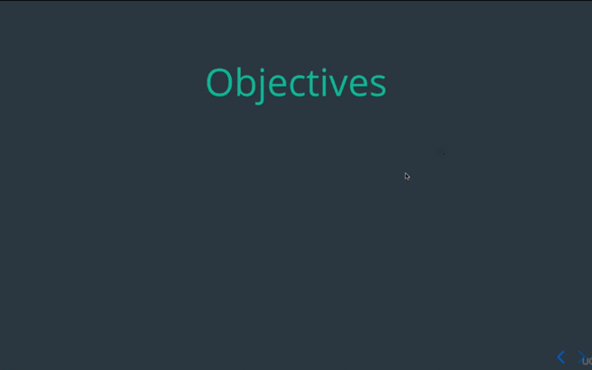

### 1. Write asynchronous Code Using setTimeout

First up **setTimeout** is Function that asynchronously invokes callback after
a delay in millisecond. So this simple example here we've got  a callback named
callback, we've got variable that the **delay** so **1000** millisecond or **1**
second. And then **setTimeout** will invoke this **callback** **1** second in
the future, one second after **setTimeout** invoked.

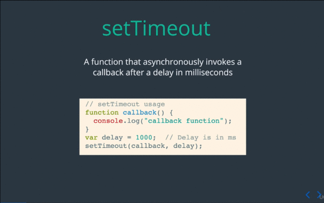

###  Write asynchronous Code Using setTimeout | setTimeout Example

Lets look **setTimeOut** example, so in this example is similar to our last one,
except that we providing now an anonymous function right inline as a parameter
to **setTimeout**. So our first parameter is **anonymous** function and our second
parameter our **delay** in millisecond.

So **2** second in from the time **setTimeout** is invoke, this function will be
invoked and we'll see **"Runs in approx. 200ms"** in the console.

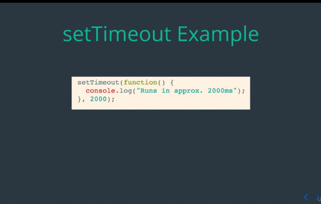

###  Write asynchronous Code Using setTimeout | Canceling setTimeout

At time may you want to cancel **setTimeout**. So every time you invoke
**setTimeout** you get back an **id** for that timeout. In this example here  we
first  have a **setTimeout** that will,

    console.log "This function runs in 30 seonds";

And we saving that that **id** to a variable **timerId**. Now we invoke
a **setTimeout** that will be run in **2** second that clear that timer.

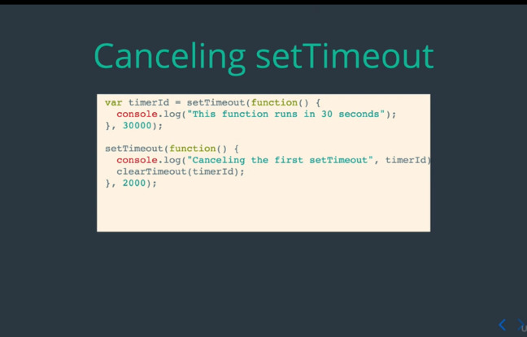

So this first timeout the callback inside the **setTimeout** will never actually
run,

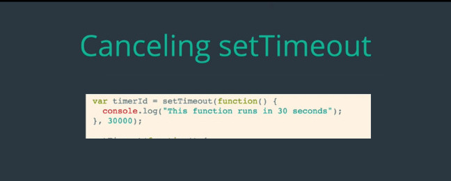

Because, this **setTimeout()** will be invoke first and it will clear the
**1st** **setTimeout**.

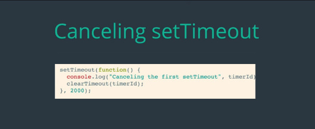

When this run we'll see something like this on the console.

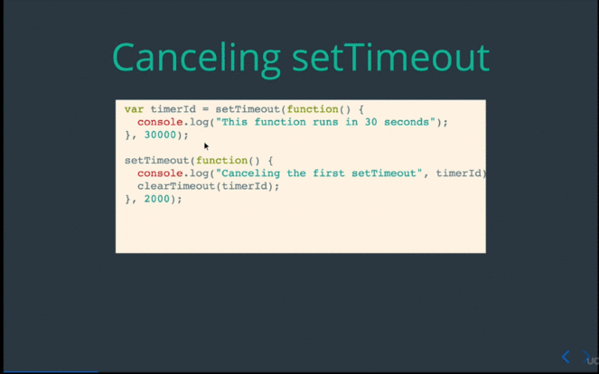

Let's see this running in the console. So we've got our code here,

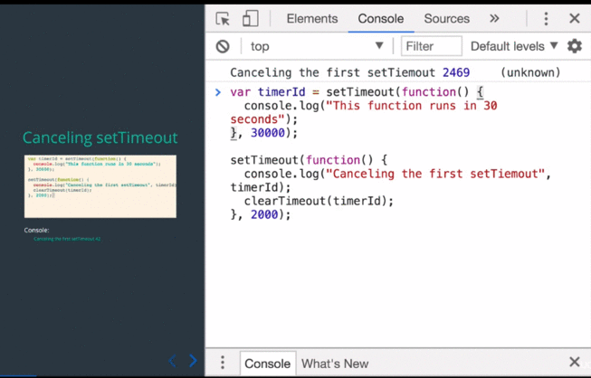

### 2. Write asynchronous Code Using setInterval

Now lets see **setInterval** works, it's very similar with **setTimeout**, the
perimeter are **callback** and the number for **delay**, but the differences is
**setInterval** will continuously invoke the callback every X milliseconds,
where the **x** the **repeat** value.

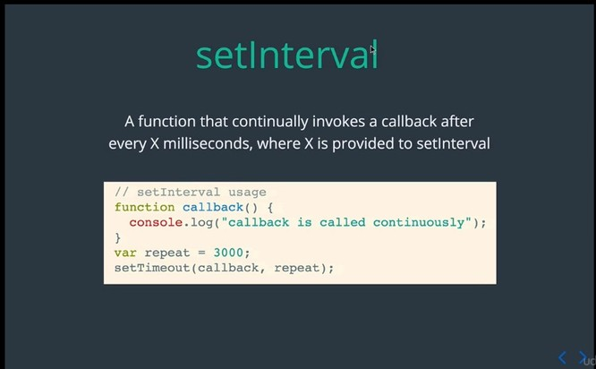

So in this example every **3** second, this **callback()** is gonna be invoke,
and it will continually run  as long as your program is running.

### Write asynchronous Code Using setInterval | setInterval Example

Here the **setInterval** example that console.log a **number** every second. So
you see here in our **callback()** function were incrementing the number and
then console logging that number after been incremented.

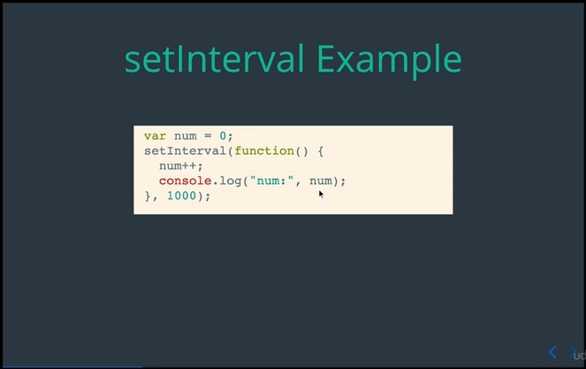

And we see in the console:

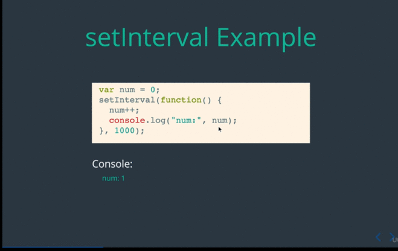

### Write asynchronous Code Using setInterval | Canceling setInterval

So just like **setTimeout** we can also cancel **setInterval**, so in this
example we starting out with the **number** equal to **0** and just like before
incrementing the number on every invocation our callback function, so this is
just gonna run every second, and then we gonna console.log the value of the
**number** that we've been incremented it.

But once number become **3** will invoke this **clearInterval** method and will
cancel our interval **(intervalId)"**. This will stop our **setInterval()**
callback from running again.

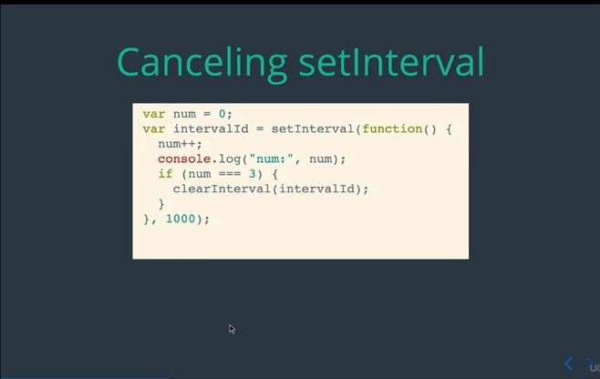

And in the console will see:

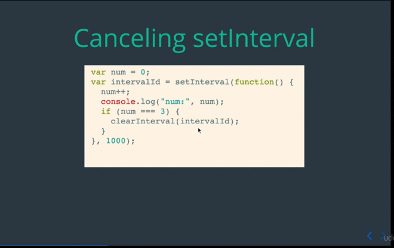

Let see what in a console:

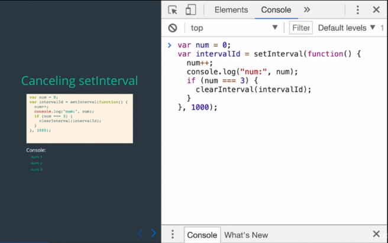

