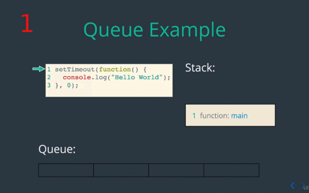

##  OBJECTIVE

Lets takes another step back and learn about the **fundamental** of how
asynchronous code works in JavaScript, by learning about the **Event Loop** and
the **Queue**, our objectives will be:

### 1. Define the event loop and the queue

#### Define the event loop and the queue | The Queue

The Queue is :

#### Define the event loop and the queue | The Event Loop

In addition to the Queue, we also need to understand:

##### Define the event loop and the queue | The Queue | Queue Example

So Here we've got an example of a**setTimeout** a pretty simple example were
just calling this **callback()** function will console.log **"Hello Wolrd!"**,
but the **key** here is that  we going to invoked **0** second from now.

So most people sort in their mind intuitively think console.log is gonna happen
immediately well not exactly. Let see what actually happen.

We've got our **main** function on the stack, and that **main** function is
gonna start out by invoking the **setTimeout** method.

So **setTimeout** will be place on the stack, and all **setTimeout** does is
takes that **callback** function that we want to run and place is it in the
**Queue**. In this example will be place in **O** second from now, so
immediately will place on the **Queue**.

We finishing with **setTimeout** that will be pop-out from the **Stack** and
then after that our **main** function will finished up. So all done there, now
our stack is **empty(11)**.

(12) So the next step here, how's the function get from **Queue** to the
**Stack**, well as we talk before that a job the **Event Loop**. **Event Loop**
will **check** the **Queue** and see if there's anything there, **if** there is
it will take out the **Queue** and place on the **Stack**.

So our **callback** function that just did console.log **"Hello World"** will be
taken from the **Queue** and places in the **Stack** by the **Event Loop(16)**.

So console.log will place on the **Stack** as another function get invoke, we
will print the "Hello World" to the console(**18**), and then console.log will
come out from the **Stack**. And finally our callback function will finish up.

And now all done, the **Stack** is empty, the **Queue** is empty, so no more
works to do for time being.

### 2. Describe how Event Loop and the Queue work with the Stack  | Queue Example : Waiting for the Stack to Empty

Lets take more little complicated example,

This again illustrate how the **Stack** and the **Queue** work together, and
specifically an **common error** is When you invoke **setTimeout** with a time
**"0"** is not actually **"0"** second is doesn't run immediately, it only run after
the **Stack** is empty, and will see that again.

So in this example we have a code that **square** a number, and before that
we've also got invocation from **setTimeout**, let take a look and see what
happen.

(**6**) First our main function is on the **stack** and we going to invoke
**setTimeout**, so **setTimeout** will be place on the **Stack**.

(**7**) Next **setTimeout** will place that function on that **Queue** so our
**callback** function with console.log will be added to the **Queue** and then
**setTimeout** will finish and come off from the **Stack**.

After that we've done with **setTimeout** function will move on to line number
**7**. In line **7** first thing to do is **square** number. (**9**)Now notice
here that nothing happen to the console yet, and  nothing is been place on the
**stack** from the **Queue**. (**10**) So this callback function down here is
still waiting be run waiting from the **Stack** to empty.

(**15**) So now we're going to invoke **square**, run line number **2** and we
passing in the number **2** for the **n** so **2** times **2** will give us
**4**, once we return **4** square is gonna come off form the **stack**, and
will be back on line number **7 (17)** in our main function, and then we put
console log on the **Stack**.

Console.log will add **"4"** to the console because that the result of our
**square** function **(19)** so we see **4**, and then console.log will come out
pull-out from the **Stack (20)** and finally our **main** function will come off
from the **Stack (21)**.

So now no more work to be done on the **Stack** and the next thing that happen,
again is the **Event Loop**. So the **Event Loop** check the **Queue (21)**, once
the **Stack** is empty, and see there's anything to be done in the **Queue**.

**(23)** The **Event Loop** sees there's a function in the **Queue** and then
places that on the **Stack (25)**, and at this point we finally have our callback
function running **(N)**.

So we are on line number **5** in our callback, and console.log will be place on
the **Stack (26)**, we'll see callback will be places on the **Queue** in our
console **(27)**, and then console.log will be taken off from the **Stack (28)**,
our callback function will be taken off form the **stack (30)**, and then our
code is done.

So the key thing in there example, was that  this callback event though we set
time out **"0"** did not actually get invoke until after the **Stack** was empty
and after **Event Loop** taken off the **Queue** and places it on the **Stack**.
**VERY IMPORTANT CONSEPT THERE**.

### 3. Define JavaScript as single threaded language.

This lead to the next important thing in JavaScript, the fact JavaScript is
**"singgle Thread"** language. So single threaded means that **the code execution
is linear**, code is running cannot be interrupted by something else going on in
the program.

#### Define JavaScript as single threaded language | Single Threaded Example

So in this **Single Threaded** example,we again how **setTimeout** going to be
invoke **0** second from now, but that's not really **0** second is approximately
**0** second. It's really means invoke that **callback** function after the
**stack** is empty.

So after we invoke **setTimeout** we have this **for-loop**. The point here this
**for-loop** is going take a while, so event though this **setTimeout** is run
in **0** second it can't run until this **for-loop** is finishes, and this
**for-loop** is take some time cause if you notice here we going **1** equal
**0** to **i** equals **1** billion, this loops is gonna take some times, and
then after that will console.log:

    Done with loop

And only after that were **callback** function run. So lot of steps here before
this **callback** function actually get invoke. Lets see that in the console.

The think to notice again is that the "Done with loop" and then the "Hello from
the timeout" wouldn't be invoke or wouldn't put in the console, untill our
**for-loop** is finish.

So as you can see here the **Done with loop** takes some times, and then only
after everything was off from the **Stack** **Hello from timeout** was invoke
and put it on the console.

