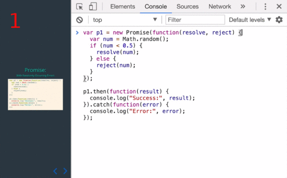
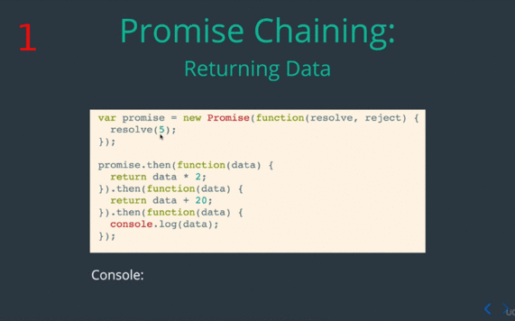
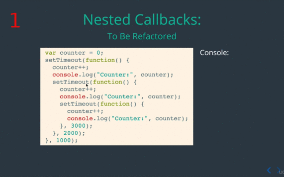
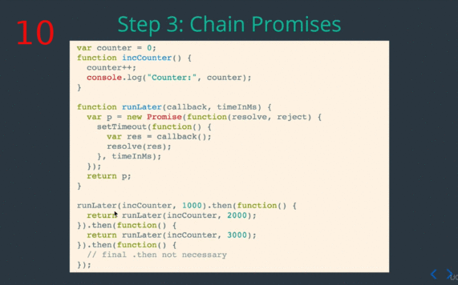
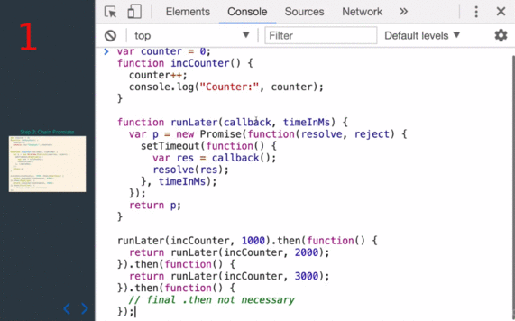
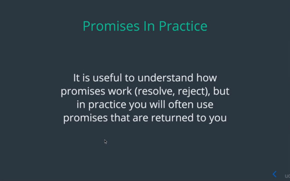

## OBJECTIVE

### 1. Define a promise

So what is promise?

You getting back an object that isn't the solution to your problem but will be
the solution in the future (in -Analogy).

#### Define a promise | Creating a Promise

Here is an example of creating a Promise:

First we are using the promise constructor, the constructor takes a single
**callback** function, that function has **2** parameter, either a **result**
function or **reject** function. So our asynchronous task will decide weather
not to call or invoke **resolve** or **reject** depending on how the asynchronous
task goes.

So if the asynchronous task completely successfully **resolve** will be invoke,
but if it didn't complete successfully or there is some error **reject** will be
invoke. Now once we have create this **Promise** we have the object as **p1**.

The next thing what we want gonna do is **define** a callback in the **.then**
function. So with this

    p1.then()

We're defining this a **callback** that will be invoke when **resolve** is in
invoke inside of the promise.

So

    ([1,2,3,4])

Get pass in into this invoke, then you can see here the console.log

    Promise p1 resolved with data, [,arr]

Lets take look in console.

So I've got my promise **p1 (1)**, and I'm gonna specified **.then** callback which
will invoke this callback function.

(**2**) as you can see **p1** is resolved with data **[1, 2, 3, 4]**, so this
console.log came from with (**3**) inner function inside of them.

### 2. Add ".then" callback to a promise | Promise: Handling Errors

Our previous example only handle the successful promise, so only handle the case
were **resolve** was invoke, but **reject** can also be invoke from the promise.

So in this example (**1**), we've got the same promise setup, we're creating
a new **Promise** and we have either **resolve** function we can invoke or
**reject** function, here we invoking **reject (2)**.

(**3**) When reject is invoke with in the **Promise**, none of the **.then**
will be invoke, so instead (**4**) **.catch** section. **Catch** is the
callback that will be invoke whenever **reject** is invoke with in the
**Promise**.

(**5**) So in this example, we only see Promise **p1** was rejected with data:
**ERROR** in the console. And where that **ERROR** come from? Well just like
before.

(**6**) When we invoke reject the string that replace in (**7**) here, will be
pass in into this callback in the **catch (8)**, so (**9**) our **data** here,
is going equal to string error that was pass from **reject (10)**, and then will
be console.log here (**11**) in our console.

### 3. Add ".catch" callback to a promise | Promise: With Randomly Occurring Errors

In this example, we combining both, the **resolve** and **reject**, here we have
50/50 change of either invoking **resolve** or invoking **reject** depending
what ever **random()** number return.

(**2**) so if **resolve** is invoke will pass that number, that randomly
generated, (**3**) and we should see on the console **Success** and what ever
number was.

(**4**) If we get the number greater then **0,5** (**5**) and **reject** is
invoke, (**6**) then  well see console.log **Error** and we'll see what ever
value get there.

So lets see this running in the console:

Because we using a random number here, we don't know if we get a **Success** or
an **Error**, lest take a look.

(**2**) We get success which mean our random number **0.254..** and **resolve**
it was invoke.

 (**9**) So we got a number that was greater then **0.5** which then invoke
 **reject** and we got an **Error**: **0.7911..**.

### 4. Wrap a setTimeout call With  Promise

In this example, that actually use asynchronous code, so all the example we've
seen so far, don't really have asynchronous component where either invoking
**resolve** or **reject** right away. But here we've got **setTimeout** inside
the **Promise**.

So this promise will be created and **setTimeout** will be invoke, and then
**4** second later will invoke **resolve**.

So now you can see the beauty of the promise, event thought this code won't have
finish running yet, will have an object already we can attach callback on to.

So this promise object will immediately will return, event though the **setTimeout**
doesn't done and **resolve** has not been called. And then we can decide what
callback function we wanna add to **".then"**.

So inside this **.then** function we providing this callback which will
console.log **"Random int passed to resolve", (randomInt)** we've got.

Lets see how this look in the console.

So we've got our code here, remember this promise will be created first before
the **setTimeout** finishes and return **resolve**.

(**2**) When I hit enter here, we've got our promise, and we gonna wait **4**
second before we see the result.

So think about the **Stack** again, all this function are off of the stack
before this **setTimeout** get invoke and then **resolve** get invoke, which one
turn **caller** callback function.

## Promise Chaining | Objectives

### 5. Describe the Disadvantages of Using Nested Callbacks

####  Describe the Disadvantages of Using Nested Callbacks | Example

So in this example, we got some messy situation, we're trying to have a callback
that depend with another callback. (**1**) in this **setTimeout** we going to
console.log the **Counter**, and once that done we wanna kick off another
**setTimeout** (**2**), but once that done so once we increment (**3**) our
**counter++** again and then displayed, we wanna kick off yet another (**4**)
**setTimeout**.

So the solution you might come up with this point, is just continually put more
callback inside of callback, and this is just a small example, you can take
a problem could end up having **10** or **12** level of **nesting** which is
really-really difficult to read. (**5**)So this code when we run it well first
print (**6**) with **1** second, and then **2** second later (**7**) will print
two, (**8**) and then **3** later it will print three.

Let's see this code running in console.

So lets talk what wrong with writing code this way, why is that bad?

(**2**) In that small example you might be able to follow, but once get bigger
and more complicated it's get really difficult to understand what going on.

(**3**) Sort in same pain, So when code get messy it's get hard to understand
exactly what going on and really takes you long time to sort of grasp what code
it does.

(**4**) The real problem is a there's a lot duplication here, but we don't have
a great way of putting it into separate function but once we use **promises**
we'll see how to do that.

Before we talk about refactoring, we need to understand the **important
concept** with promises called **Promises Chaining**.

So **Promise Chaining** is allow multiple **.then** functions to be chain to
a promise, and the really need thing is if a previous callback inside **.then**
return a promise, the next callback inside **.then** will be waiting with that
previous promise to be **resolve**.

(**1**) So in this case we've got a promise to get **resolve** in **500**
millisecond.

(**2**) and this first **.then** will be waiting for that promise to finish.

(**3**) now inside that callback we returning a new promise that **resolve** in
**3000** millisecond.

(**4**) and the next **.then** will be waiting on this (**5**) to finish.

Alright this important one, lets take a look on the console again.

(**3**) I see "Random int passed to resolve: 3"  from my first callback (**4**)

(**5**) and **3** second later I will see "Second random int passed to resolve:
6" from my (**5**) second callback.

(**7**) now lets change the value and see what we get after that. So I make the
first **setTimeout** **3000** millisecond.

(**8**) and I make the second value from promise **.then** chain make something
quick like **500** millisecond.

(**10**) as you can see the first promise take **3** second.

(**11**) and half second later we get the second promise.

So really cool features we can combine asynchronous task into a **chain
promisess**.

### 6. Return a Promise From ".then" Callback Function | Promise Chaining : Returning Data

Promise is not the only thing is can return from inside **.then** callback
thought. A promise callback can also return **value**, so the value return in
previous **.then** callback will be pass in to the next **.then** callback as
a **parameter**.

(**1**) we were **resolving** with **5**, and this first callback.

(**2**) will receive **6** as data,

(**3** )and then will return **5** times **2** which is **10**.

(**4**) which will be pass in to next **.then** callback so now **data**
equal to **10**.

(**5**) and **10** plus **20** it give us **30**.

(**6**) now the next callback gets **30**.

(**7**) and finally we console.log that **30**

#### Return a Promise From ".then" Callback Function | Nested Callbacks: To Be Refactored

How we use **promises** to help solve this problem?

Lets take step by step,

(**1**) first we create a function definition for just the incrementing portion.
So this function all it does is take in our **counter++** increment it, and then
console.log what ever the value counter is. And that functionality is the same
through out each callback.

(**2**) So now we create a function call **runLater**, and this is very generic
function that will take **callback** and **timeInMs** as a argument, and run
that callback using **setTimeout** but it will wrap the **setTimeout** in
a **Promise**.

(**3 - 4**) So this **runLater** function at the end will return new **promise**
that we can attach **.then** or **.catch** callback to. Inside the **Promise**
**setTimeout** is invoke, the callback run after the delay,

(**5 - 7**) after **timeInMs** delay, and the value return from this **callback()**
that invoke inside of the function is then pass through to **resolve**.

So this will work with pretty much any callback function you want, and the goal
is return a normal **setTimeout** call into a promised vie **setTimeout**.

(**8**) now we going to use **runLater** function and promise chaining we learn
earlier to refactor the code that we had before.

(**9**) so the first **runLater** here, will invoke **incCounter** function in
**1** second.

(**10**) Remember **runLater** return a promise, so we can attach **.then** to
that promise. This callback will be invoke after the **incCounter** has a result

(**11 - 13**) and then will return a new promise form now on later, which also
invoke **incCounter** in **2000** millisecond.

(**14 - 16 **) then the next **.then** callback invoke will return a new promise
which run the **incCounter** in **3000** millisecond.

(**17-18**) and finally this last **.then** is unnecessary, but if you wan to put
there final code there like console.log or something else, you could. So this
essentially inside this **.then** we know that the code is done.

Let see on the console,

We refactor messy code from using **nested** callback into using **Promises**,
and this code much easier to read once you understand what **Promises** and
**Promises Chaining** are doing here.

One last thing I want point out here,

Later on when you use promises especially on AJAX, you not gonna be creating
a new promise yourself rather you gonna be given a promise as result invoking
some function, specifically you gonna be using the new **Fetch** functionality
and **Fetch** will return a new promises to you.

So event thought you don't create your own promises, it's useful to understand
what there doing both **resolve** and **reject**, so I hope that was helpful.
