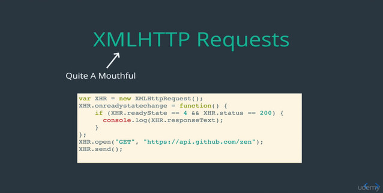
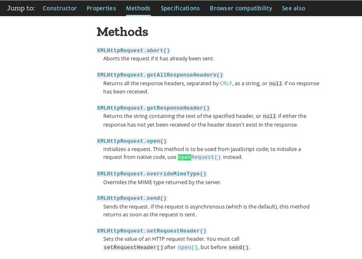
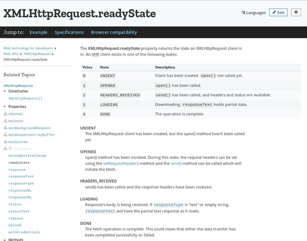
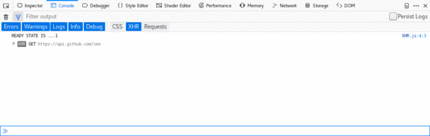
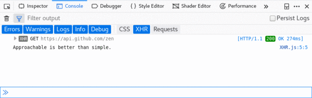
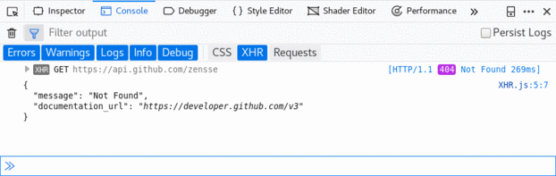

## OBJECTIVE | XHR or XMLHTTP Requests

go to this link [MDN](https://developer.mozilla.org/en-US/docs/Web/API/XMLHttpRequest)

So our end goal is **request** an API and get data back. The API we work with is

    https://api.github.com/zen"

So what we wanna do is request that URL through JavaScript is reference our
**XHR** variable to the method **.open** and **.send**.

This is several method for XHR:

If you not familiar with HTTP Request **verb** there's couple different options
we gonna make a **GET** request because we wanna retrieving information, and the
second thing we need to provide is **URL** what are we requesting.

    XHR.open('GET', "https://api.github.com/zen");

So on it's own this is kind of bare-bone that actually make request, so if I open
up the console with this code,

    var XHR = new XMLHttpRequest();

    XHR.open('GET', "https://api.github.com/zen");
    XHR.send();

Nothing happen, that doesn't mean that the request is being made, it just mean
we not doing anything about it, we are not retrieving the data, we're not
displaying it we certainly not console.log it. To do that we need to understand
little bit more about how the request actually work, so there's property called
**.readyState** on every request, it can be **5** different options, lets take
look on this,

There are number **0** up to **4** and correspond different state of the
request, so it start with **UNSENT** all the way up to **DONE** along the way
there are couple steps.

So what we want to do most the time at least, is basically have the request go
off and then do something when it **DONE**, when our data is back. So we wanna
be able to check when is **.readyState** is **DONE**, and the way we do that is
by taking advantage of an event call **.onreadystatechange**, so this will call
a function every time the **.readyState** changes, so go from **0** to **1**,
**1** to **2**, **2** to **3**, **3** to **4**. And then inside of that we will
be able to check is **.readyState** is done, as soon is it done we can do what
ever we like with the code.

So we add this **eventListener**

    XHR.onreadystatechange = function() {

    }

What ever we doing at this function, what happen any time that **.readyState**
changes. So if we console.log it inside this function,

    XHR.onreadystatechange = function() {
      console.log("READY STATE IS..." + XHR.readyState);
    }

So what we gonna do in if statement the **.readyState** is equal **4**, we wanna
call **.responseText**.

    XHR.onreadystatechange = function() {
      if (XHR.readyState === 4) {
        console.log(XHR.responseText);
      }
    }

We got our data back.

So last thing I wanna talk about, is what happen if the request is doesn't
actually work? What if are our URL we requesting doesn't exist, or server down,
or potentially we have a typo, we can actually handle that in our code, we can
have add case were we checking the response didn't actually work to the request
go through, and what signify that to us is the status code. So you have seen
before **404** status code, if we wanna check it's something work we gonna check
if status code is **200** and then we have otherwise.

    XHR.onreadystatechange = function() {
      if (XHR.readyState === 4) {
        if(XHR.status === 200) {
          console.log(XHR.responseText);
        } else {
          console.log("There was a problem!");
        }
      }
    }

