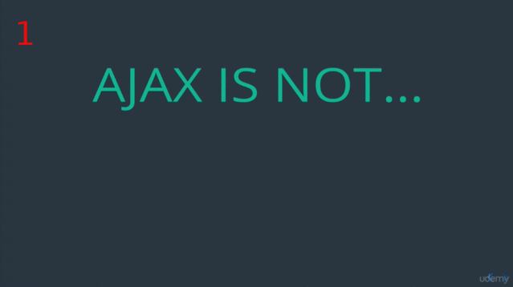
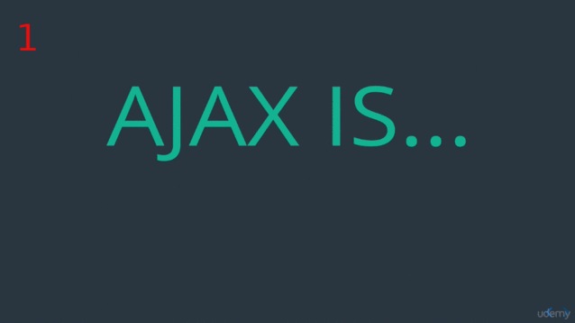
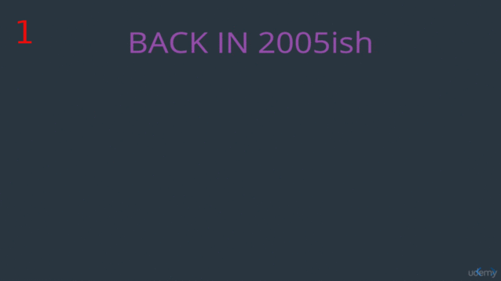
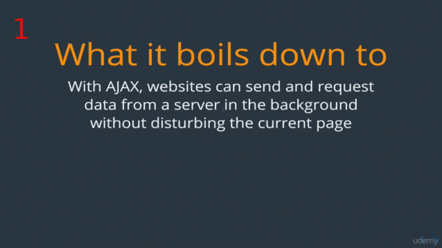
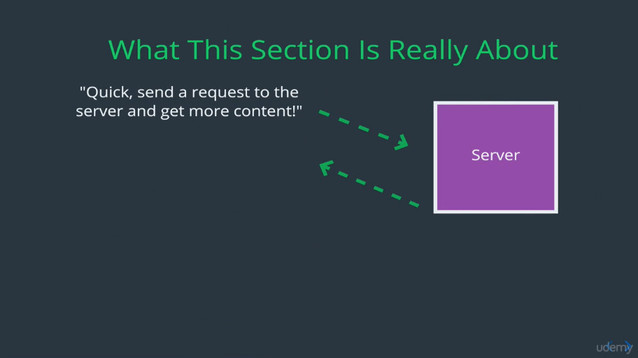
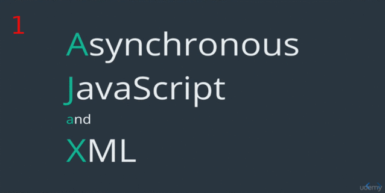
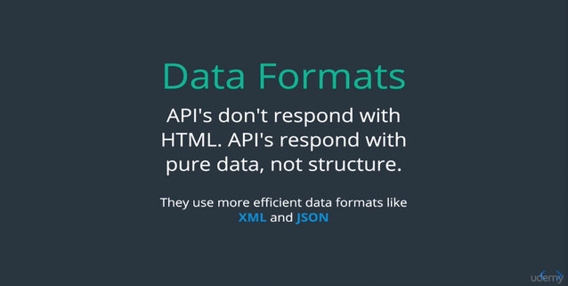
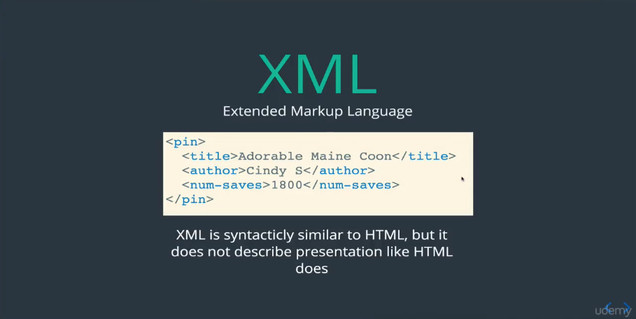
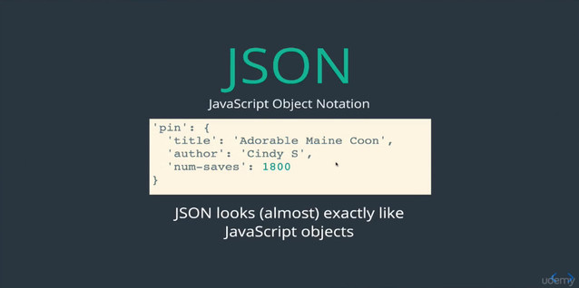
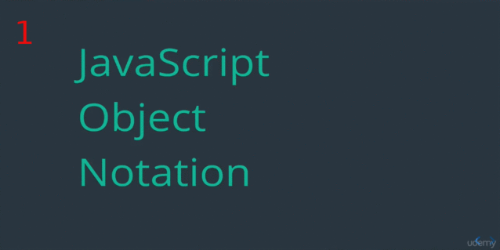

## AJAX 

### AJAX is not:

### AJAX is:

**AJAX** is an approach to web development. A concept, a way of building website.
So this revolution that AJAX was just comes down to a different way structuring
apps, using existing tools and technology, so just putting them together in
different way.

### AJAX | Back in 2005

**XMLHTTP Request** is a tools on **API** that allow to make **request** can
remote full from the browser using JavaScript.

This **5** things plus the **API** they give you the ability to make **request**
from your browser, combine a what from AJAX? With this a cutting edge technology
common developer have saying:

    "All the pieces are here for us to make a web apps that can update without refreshing!"

### AJAX | What it boils down to

### AJAX | What happening with pinterest

(**1**) I hit the bottom of the page,

(**2**) and that trigger an event

(**3**) send a request to a server and get more content.

(**4**) This the **key** part, this is what different, in the pass this will be
a page refresh, to be a separate request on your browser, but with AJAX the
ability to make request through JavaScript it just happen on the background
while you on the bottom of the page.

(**5**) So it's happen. Server send it back a request, and then with JavaScript
once I have the data back,

(**6**) then inserted to the page with some new HTML that requested. So not just
inserting data but make image tag what ever inside.

So this is really common work flow. What really boils down into this,

### AJAX | Making Requests with JavaScript

So we will talk about a couple different way here making a request, and the long
way we build a couple demonstration in an app that illustrate how AJAX works and
the **flow** putting pieces together.

Remember, is the confluence of this technology that allow us to make seamless
web app where data is being move back and forward on the background and the
pages updated dynamically without the user having to refresh the page.

## XML and JSON | What's The Deal With JSON and XML?

Essentially they both **Data Format**, so this is portion of a diagram, a much
larger diagram  from previous lecture that really reflection the important stuff
the **request** and the **responses**.

(**6**) So really about here, this little part diagram, when the **server** and
**API** response with **data** in this case pinteres data to produce a new
**pins** so that contain information probably like **URL** for images for each
pins, **number of time** people save it, a **caption**, a **date**, the
**person** who post that pins.

So all that data has to be send back from the server to our JavaScript so that
can be added to the page, and the question is, What is data actually look like?
How is it send? That **data formnat** come in.

### XML | Data Formats

So we're use to think like HTML as developer that what we work with, that is
a way formatting data or representing it, but the problem with HTML in this
context is that HTML in code structure.

API exist to share information between computer, between bits of code rather
then human, so the structure the style rather that matter. So in stand formats
like XML and JSON are use, and the API set we use today and we'll use in this
course almost all JSON, and we talk about more why?, and I also wanna to add
later on the course we'll be making our own API using **node**, create our own
backend and we actually write AJAX request to our own API that also response
from JSON, and that really **common think** like single pageApp using thing like
**React** or **Angular** having a JSON backend, or JSON API on your backend.

So lets start diving into the detail of XML first,

XML it's been around long time, it look very similar to HTML but rather then
encoding a page structure, it just encode information and relationship between
data, here potentially representing little bit info from pinterets

So XML is use to be popular it still use occasionally but it's been replace,
it's been new serve by another format, called JSON.

The same exact information represented in a different way, where we have **key
value pairs** and essentially looks like **JavaScript Object** pretty much
exactly like JavaScript.

So AJAX rose and as more people start it to make request from JavaScript. JSON
start to be a format of choice because if you working with JavaScript it's so
much easier to parse the process the data coming back from API if it's JSON.

Asynchronous JavaScript and JSON (**AJAJ**) it's really what to use this day for the most
part but **AJAJ** doesn't have quit the same ring as **AJAX**, so even the
people said **AJAX** typically is actually **AJAJ** these days.

