12 July, 2018. Thu 20:06

##  === OBJECTIVE ===

    1. Compare and contrast raster and vector graphics
    2. Create SVG elements in the DOM
    3. Draw lines using SVG
    4. Create groups of SVG elements.
    5. Draw rectangles, polygons, and circles using SVG
    6. Write text on SVG
    7. Use D3 to build an SVG bar chart

## SVG | Introduction to SVG

SVG stand for: **Scalable Vector Graphic**

When you dealing graphic with computer there two different types:
1. Vector graphic

Vector graphic in other hand use **line** and **curve** as their fundamental
building blocks.

2. Raster graphic

The fundamental block of Raster images is the **pixels**. Many common picture format
like 'gif', 'jpeg' and 'png'.

The big different between **Vector** and **Raster** graphic has to do behavior under
scaling if you zoom in in Raster image you increasing the size of the pixels so
the image become **pixelated** and **granny**. Vector graphic however is scale
without any degradation quality. SVG is markup language base on **XML**. That
allow us to draw vector graphic in HTML. The Mozilla Developer Network (MDN)
summarize well. **SVG is essentially to graphic what HTML is to text**

### The SVG Element

    <svg version ="1.1"
         baseProfile="full"
         xmlns="http://www.w3.org/2000/svg">
    </svg>

### Line Elements
line determine by full points.

    * x1 -x-coordinate of first endpoint
    * y1 -y-coordinate of first endpoint
    * x2 -x-coordinate of second endpoint
    * y2 -y-coordinate of second endpoint

==============================================

    <svg version ="1.1"
         baseProfile="full"
         xmlns="http://www.w3.org/2000/svg">
         <line x1="100" y1="100" x2="700" y2="350"/>
    </svg>

By default line has no width to make line visible we need to set the
**stroke-width** we can also set the color with the **stroke attribute**.

    <line x1="100" y1="100" x2="700" y2="350" stroke-width="5px" stroke="blue"/>

If you look carefully of the line you might notice something strange our line
start x1="100" y1="100" goes to x2="700" y2="350". If you drew this in
high school math class it would have positive slope but the line on SVG slope
downward. To understand why slope goes down we need to understand how
**Coordinates** work on SVG.

### Coordinates in SVG

Typically when you graph things in math class positive number increase from left
to right aling the *x-axis* and bottom to top along the *y-axis*. But with SVG
the *y-axis* is reverse value increase is you **go down** not is you **go up**.
Put in another way in math class the point coordinate **0,0** typically in lower
left corner system. But in SVG this point is in the **upper left** corner. As you
move to the right the first coordinates increases and as you move down the
second coordinates increases.

The Fact why the *y-axis* is flip is little bit confusing, but D3 have
functionality that would allow us *y-axis* flip back to the orientation you maybe
comfortable with it, for now we left with it.

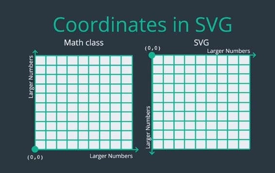

Let draw another line to format "**X**"

    <svg version ="1.1"
         baseProfile="full"
         xmlns="http://www.w3.org/2000/svg">
        <line x1="100" y1="100" x2="700" y2="350" stroke-width="5px" stroke="blue"/>
        <line x1="100" y1="350" x2="700" y2="100" stroke-width="5px" stroke="blue"/>
    </svg>

Now we get this "**X**" on the SVG we may want to thinks of two lines not is
independent pieces but is a group that form the single "**X**". If you want to
take this approach you can wrap both line in **g-element**.

### g Elements

**g** stand for "group"

The advantage to this is you can set certain attributes bit functionality the
group level instead duplicating the attributes each element the of the group.

In this example we can move stroke-width and stroke setting in **g-tag**.

    <svg version ="1.1"
         baseProfile="full"
         xmlns="http://www.w3.org/2000/svg">
        <g stroke-width="5px" stroke="blue">
        <line x1="100" y1="100" x2="700" y2="350"/>
        <line x1="100" y1="350" x2="700" y2="100"/>
        </g>
    </svg>

### Rectangle Elements

Rather then drawing four line to create rectangle we can also draw rectangle by
using **rect element**. The location and size rectangle is determines by four
attributes

    * x - x-coordinate of upper-left corner
    * y - y-coordinate of upper-left corner
    * width - width of rectangle
    * height - height of rectangle
    * stroke - border color
    * stroke-width - border thickness
    * fill - interior color

Lets draw rectangle on SVG

    <svg version ="1.1"
         baseProfile="full"
         xmlns="http://www.w3.org/2000/svg">
      <rect x="50" y="50" width="300" height="200" fill="#ffc107"
      stroke="2196f3" stroke-width="8px" />
      <rect x="100" y-"200" width="300" height="400" fill="e91e63"
      stroke="#795548" stroke-width="8px"/>
    </svg>

A couple of things to notice here, First if your shape exist the bound of SVG it
will get crop element. Non SVG don't extend the bound of SVG. Second there is
some overlap between our rectangles.

In this case the second rectangle is sitting on top of the first rectangle. But
what if that was not we want? what if we want the second rectangle to sitting
behind the first rectangle?

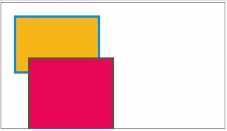

You might think we need to adjust the **z-index** or some other property on the
element. But there's no "z-index" property at SVG elements instead shape on SVG
are draw appear in the document.

If we want to draw the red rectangle behind the orange rectangle we have to draw
the orange rectangle as a second rectangle.

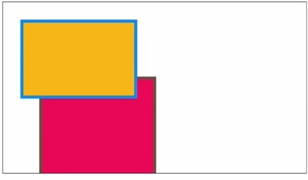

One last thing we can also round the corner of rectangle using **rx** adn **ry**
attributes.

##### More rectangle Attributes

    * rx - round corner in x direction
    * ry - round corner in y direction

The bigger the values the more rounded the corner. When the values are the same you
get circular corner. When the values are different the corner surrounded in oval
or electrical shape. Every rectangle were sharp corner it is example of the
polygon. An SVG polygon as initiate by straight line edges. You can draw an
arbitrary polygon by using polygon element.

### Polygon Element

Polygon Attributes:

    * points - space-separated list of points representing vertices of the
      polygon
    * points are of the form "x1, y1 x2,y2,.."

Here we rewrite existing code use **polygon** elements instead of **rectangle**.

    <svg version ="1.1"
         baseProfile="full"
         xmlns="http://www.w3.org/2000/svg">
      <polygon points="50,50 350,50 350,250 50, 250" fill="#ffc107"
      stroke="2196f3" stroke-width="8px" />
      <polygon points="100,200 400,200 400,500 100, 500" height="400" fill="e91e63"
      stroke="#795548" stroke-width="8px"/>
    </svg>

We got one attributes instead of four, but we have to do some arithmetic to
compute coordinate the four corners of rectangle. All polygon are rectangle
and not all rectangle are polygon.

Here an example that rectangle isn't polygon:

    <svg version ="1.1"
         baseProfile="full"
         xmlns="http://www.w3.org/2000/svg">
      <polygon
        fill="yellow"
        stroke="black"
        stroke-width="8px"
        points="400, 21.5 450.5, 177 614, 177 481.5, 273 532.5, 428.5 400, 332.5
        267.5, 428.5 318.5, 273 186, 177 349.5, 177"
        />
    </svg>

### Circle Elements

Circle Attributes:

    * cx - x-coordinate of center
    * cy - y-coordinate of center
    * r - radius of circle

Lets draw some circle:

    <svg version ="1.1"
         baseprofile="full"
         xmlns="http://www.w3.org/2000/svg">
      <polygon
        fill="yellow"
        stroke="black"
        stroke-width="8px"
        points="400, 21.5 450.5, 177 614, 177 481.5, 273 532.5, 428.5 400, 332.5
        267.5, 428.5 318.5, 273 186, 177 349.5, 177"
        />
        <cirlce cx="400" cy="250" r="60" fill="black" />
        <cirlce cx="400" cy="250" r="65" fill="yellow" />
        <cirlce cx="370" cy="210" r="10" fill="black" />
        <circle cx="430" cy="210" r="10" fill="red" />
    </svg>

### Text Elements in SVG

When you use **text** element at minimum you should specify where you want to be
using the **x** and **y** attributes.

##### Text attributes

    * x - x-coordinate of lower-left corner
    * y - y-coordinate of lower-left corner

The **x** and **y** coordinate pass in refer to the position of the bottom left
corner of the text, as you can see this can make for text element that off
center.

    <svg version ="1.1"
         baseprofile="full"
         xmlns="http://www.w3.org/2000/svg">
         <polygon .../>
         <text x="400" y="430">Starry staryy SVG</text>
     </svg>

If you want center the text there are a are a couple ways to do it. One is to
use **dx** or **dy** attributes to shift the text element from anchor point
horizontally or vertically. However this require you before hand the amount you
need to shift by.

##### More text attributes

    * dx - x-coordinate of lower-left corner
    * dy - y-coordinate of lower-left corner

     <text x="400" y="430" dx="60">Starry staryy SVG</text>

The simpler approach to use the text anchor property which you can set either as
an attributes the element or using CSS 

Text anchor have 3 possible values.

##### Text element CSS Properties | text-anchor

    * start
    * middle
    * end

If you set it to **midldle** well refer to position the bottom-middle of the element.
If you set it to **end** the coordinate will refer to the position of the bottom
right corner.

     <text x="400" y="430" text-anchor="middle">Starry staryy SVG</text>

##### Text element CSS Properties | Alignment-baseline

    * hanging
    * middle
    * baseline

    <text x="400" y="430" alignment-baseline="middle">Starry staryy SVG</text>

We can also set other CSS properties like **font-size** and **font-family**. We
can even can set **color**. However unlike font outside of SVG we need to set
**color** with **fill** and **stroke** just like other SVG elements.

    <text x="400" y="430" text-anchor="middle" font-size="1.5em"
    font-family="sans-serif" fill="white" stroke-width="1px" stroke="black">
    Strayy starry SVG</text>

We can also **rotate** text this is particularly helpful if you try to label
axis and need text to be vertically align.

##### Text element CSS Properties | transform

    * rotate(degree x,y)

In order to rotate you should specify degree of rotation and the coordinate
point that you want to rotate around.

e.g:

    <text x="400" y="430" text-anchor="middle" font-size="1.5em"
      font-family="sans-serif" fill="white" stroke-width="1px" stroke="black"
      transform=rotate(-10 400, 430)
    >
    Strayy starry SVG</text>

**The same technique can be use to rotate other shape we've look at like
_circle_ and _polygon_**.

### Path Element in SVG

 This is the most complex element we will discuss. And can be tough is brought
 generalization of  **line, circle, rect, polygon** in fact you can draw all of
 shape we all ready drawn with just **path** element.

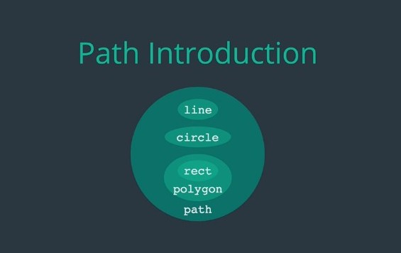

With great power often comes a new syntax and syntax of creating **path** is
difficult to read. In general if you working with SVG frequently you more likely
to using program to sketch the SVG and then export it. So relevant **path**
command automatically generated. However it's good to know what this command
doing.

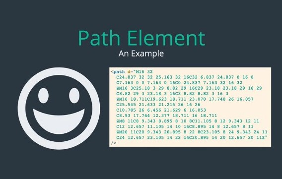

##### Path Elements | "d" Attributes commands

The most important path attributes is "d" attributes command. This is we
describe the **path** will be drawing. You can thinking drawing a **path**
similar to draw **path** with a pencil with a piece of paper. Our job now is to
describe to computer how we wanna move the pencil.

There are six  fundamental command to draw a **path**

    * M- (move)
    * L - (line)
    * S - (close path)
    * Q - (quadratic Bezier curve)
    * C - (cubic Bezier curve)
    * A - (circular arc)

##### Path Element | Move command

    * Syntax: M X Y
    * Moves the cursor to position X, Y
    * Does not Draw anything

This is like you lifting your pencil off the paper and putting it down in a new
location. The M command not draw anything it's simple move the cursor.

If we want move the cursor with "x"coordinate: **400** and "y"-coordinate: **100**
this is what we write.

    <svg version ="1.1"
         baseprofile="full"
         xmlns="http://www.w3.org/2000/svg">
     <path
        d="M400 100"
     />
     </svg>

This move cursor **400** pixels over and **100** pixels down.

##### Path Elements | Line command

    * Syntax: L X Y
    * Draws a line from the cursor's current position
    * The Line will end at position X,Y
    * Can be chained together to draw multiple line segments.

By chaining **L** command together we essentially get same functionality that we
have at **polygon** command from before.

Here example we can draw **triangle** for instance:

    <svg version ="1.1"
         baseprofile="full"
         xmlns="http://www.w3.org/2000/svg">
     <path
        d="M400 100
           L500 300   >> drawing line down into the right
           L300 300   >> drawing line down into the left
           L400 100"  >> drawing line up into the right
        stroke="red"
        stroke-width="3px"
     </svg>

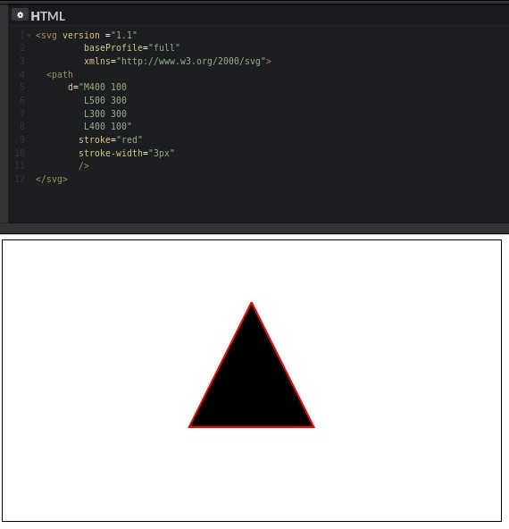

Notice that both this command use Uppercase letters the are lowercase
equivalent but come with important different.

##### Uppercase vs Lowercase

    * UPPERCASE X Y - X and Y represent the "location" you want to go to.
    * lowercase X Y - X and Y represent "how far" you want to go from your current
      position.

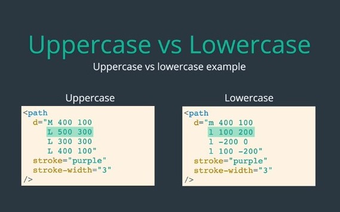

The cursor start to 0,0 so there's no different with **M** and **m** for the
first command. Moving to the point coordinate 500,300 is equivalent to moving
100 pixels over and 200 pixels down you can compare the last two command in the
similar way.

##### Path Elements | line command shortcut

    * Z / z - close the path with a line
    * H / h - draw a horizontal line
    * V / v - draw a vertical line

So we can simplify our previous **path** example.

    <svg version ="1.1"
         baseprofile="full"
         xmlns="http://www.w3.org/2000/svg">
     <path
        d="M400 100
           l100 200
           h-200
           z"
        stroke="red"
        stroke-width="3px"
     </svg>

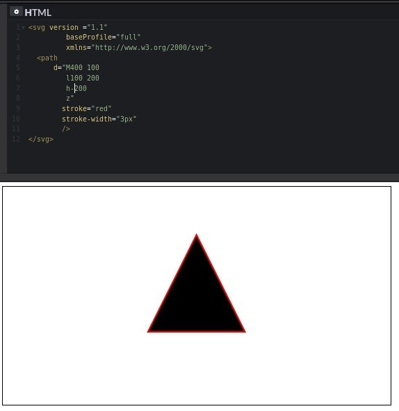

#### Path Elements | curve command

    * Q - quadratic curve
    * C - cubic bezier curve
    * A - circular arc

##### Path Elements | quadratic curve

    * Q - cx cy, x y

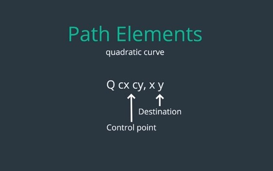

    <svg version ="1.1"
         baseprofile="full"
         xmlns="http://www.w3.org/2000/svg">
      <g fill="none" stroke-width="10px">
        <path d="M0 225 Q 400 0 225" stroke="red" />
        <path d="M100 100 Q700 200 700 350" stroke="blue" />
      </g>
     </svg>

=====================================================

        <path d="M0 225 Q 400 0 225" stroke="red" />
                        ^     ^
                        ^  (x y)Destination
            (cx cy)Control point
or

        <path d="M100 100 Q700 200 700 350" stroke="blue" />
                          ^         ^
                          ^  (x y) Destination
            (Q cx cy) Control point

If you want more find tune control over the curve save then you can pass
**three** parameter of coordinate into **C**-command.

##### Path Elements | cubic bezier curve
The **C** command takes in **two control point** instead of **one**. Allowing
you to draw a large family of curves.

    C cx1 cy1, cx2 cy2, x y

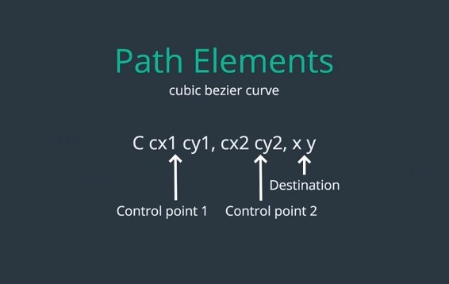

e.g:

    <svg version ="1.1"
         baseprofile="full"
         xmlns="http://www.w3.org/2000/svg">
      <g fill="none" stroke-width="10px">
        <path d="M0 225 C 200 450 400 0 800 225" stroke="red" />
        <path d="M0 100 C 600 450 400 0 800 225" stroke="orange" />
        <path d="M100 100 C0 0 700 200 700 350" stroke="blue" />
      </g>
     </svg>

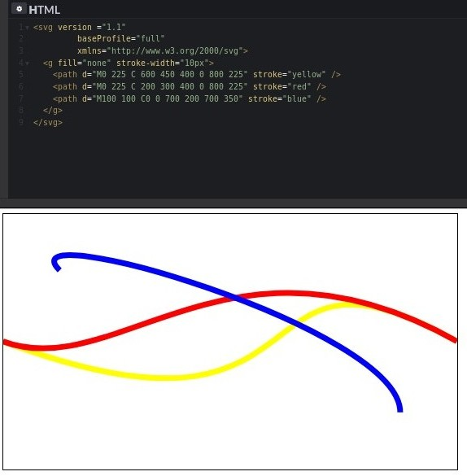

        <path d="M0 225 C 200 450 400 0 800 225" stroke="red" />
                          ^       ^     ^
                          ^       ^   (x,y)Destinantion
                          ^ (C cx2, cy2) Control point
                    (C cx1, cy2) Control point

##### Path elements | circular arc

This one is little bit tricky because the value you should to pass in. There are
seven value you need to out command some easier to describe then the other.

    * A rx ry - when this value are equal you draw the arc of "circle" otherwise
                you draw the arc of "ellips".
    * x y - specify your destination.
    * Let ignore the middle three parameter for now.

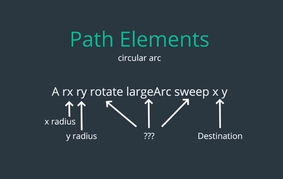

Imagine you have SVG with these three element inside of it. A path with
**arc**-command one circle with the start of the **arc** and another at the end.
As you can see this give small green circular **arc** with two black circle an
either end.

    <svg version ="1.1"
         baseprofile="full"
         xmlns="http://www.w3.org/2000/svg">
        <path d="M300 250 A100 100 0 0 0 480 300" fill="green" />
        <circle cx="300" cy="250" r="5" />
        <circle cx="400" cy="300" r="5" />
     </svg>

Lets look up at an example imagine you have an SVG with these three element
inside of it a path with an **arc** command one circle at the start the **arc**
and another at the end. As you can see this give us small green circular **arc**
with two black circle an either end.

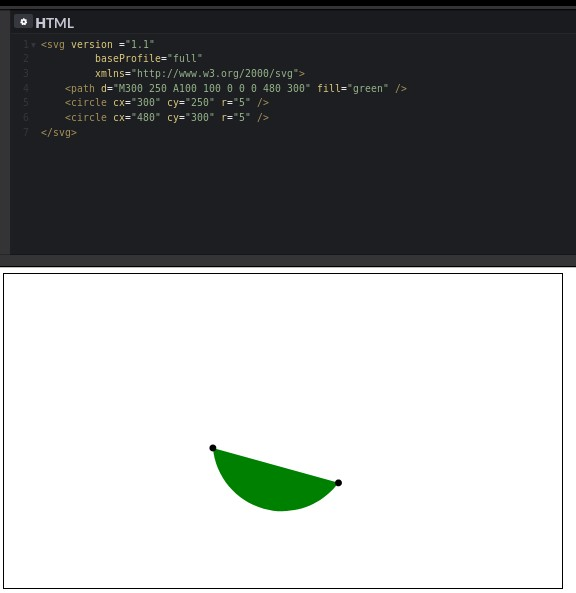

However this choice of **arc** is some of arbitrary, there actually four possible
**arc** that can be made with this two points because there two circle you can
draw base on that points and for each circle you can choose weather to draw the
larger **arc** or the smaller **arc**.

The **arc** thicket drawn is determine by the fourth and fifth argument, which
both take on value of "**0**" or "**1**".

Here all four possible combination these arguments.

    <svg version ="1.1"
      baseProfile="full"
      xmlns="http://www.w3.org/2000/svg">
        <path d="M300 250 A100 100 0 1 0 480 300" fill="red" />
        <path d="M300 250 A100 100 0 1 1 480 300" fill="purple" />
        <path d="M300 250 A100 100 0 0 0 480 300" fill="green"  />
        <path d="M300 250 A100 100 0 0 1 480 300" fill="blue"/>
        <circle cx="300" cy="250" r="5" />
        <circle cx="480" cy="300" r="5" />
    </svg>

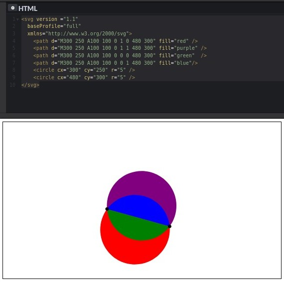

What about that third value? This control rotation of the **arc**. For
circular **arc** they won't have an effect since circle are symmetric. But if
you make **Radian** different so you get an ellipse changing this value will
rotate the ellipse.

      <path d="M300 250 A100 100 0 1 0 480 300" fill="red" />
                                 ^ ^
                                 ^ ^
      <path d="M300 250 A100 200 90 1 0 480 300" fill="red" />
                          ^   ^  ^  ^ ^
                          ^   ^  ^  ^ sweep the "arc"
                          ^   ^  ^  largeArc
                          ^   ^  rotate
                          ^   y radius
                          x radius

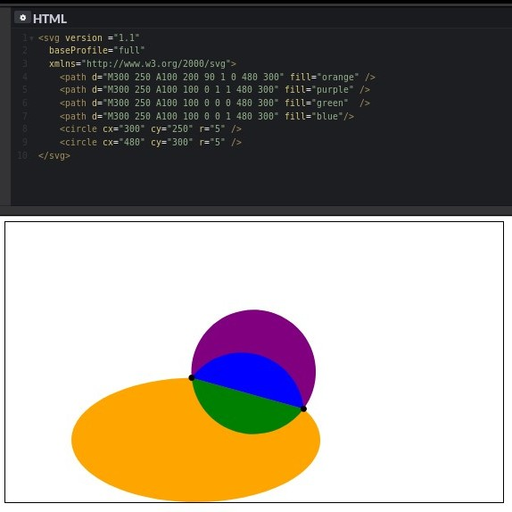
