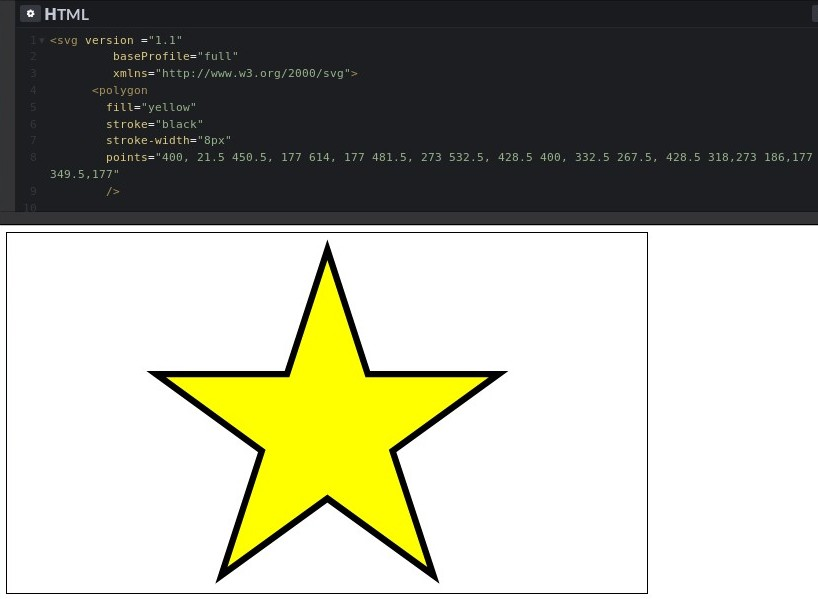
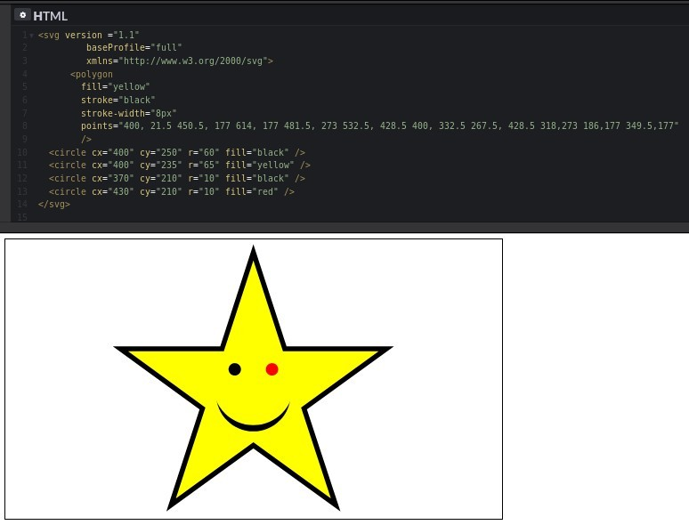

12 July, 2018. Thu 20:06

##  === OBJECTIVE ===

    1. Compare and contrast raster and vector graphics
    2. Create SVG elements in the DOM
    3. Draw lines using SVG
    4. Create groups of SVG elements.
    5. Draw rectangles, polygons, and circles using SVG
    6. Write text on SVG
    7. Use D3 to build an SVG bar chart

## SVG | Introduction to SVG

SVG stand for: **Scalable Vector Graphic**

When you dealing graphic with computer there two different types:
1. Vector graphic

Vector graphic in other hand use **line** and **curve** as their fundamental
building blocks.

2. Raster graphic

The fundamental block of Raster images is the **pixels**. Many common picture format
like 'gif', 'jpeg' and 'png'.

The big different between **Vector** and **Raster** graphic has to do behavior under
scaling if you zoom in in Raster image you increasing the size of the pixels so
the image become **pixelated** and **granny**. Vector graphic however is scale
without any degradation quality. SVG is markup language base on **XML**. That
allow us to draw vector graphic in HTML. The Mozilla Developer Network (MDN)
summarize well. **SVG is essentially to graphic what HTML is to text**

##### The SVG Element

    <svg version ="1.1"
         baseProfile="full"
         xmlns="http://www.w3.org/2000/svg">
    </svg>

##### Line Elements
line determine by full points.

    * x1 -x-coordinate of first endpoint
    * y1 -y-coordinate of first endpoint
    * x2 -x-coordinate of second endpoint
    * y2 -y-coordinate of second endpoint

==============================================

    <svg version ="1.1"
         baseProfile="full"
         xmlns="http://www.w3.org/2000/svg">
         <line x1="100" y1="100" x2="700" y2="350"/>
    </svg>

By default line has no width to make line visible we need to set the
**stroke-width** we can also set the color with the **stroke attribute**.

    <line x1="100" y1="100" x2="700" y2="350" stroke-width="5px" stroke="blue"/>

If you look carefully of the line you might notice something strange our line
start x1="100" y1="100" goes to x2="700" y2="350". If you drew this in
high school math class it would have positive slope but the line on SVG slope
downward. To understand why slope goes down we need to understand how
**Coordinates** work on SVG.

##### Coordinates in SVG

Typically when you graph things in math class positive number increase from left
to right aling the *x-axis* and bottom to top along the *y-axis*. But with SVG
the *y-axis* is reverse value increase is you **go down** not is you **go up**.
Put in another way in math class the point coordinate **0,0** typically in lower
left corner system. But in SVG this point is in the upper left corner. As you
move to the right the first coordinates increases and as you move down the
second coordinates increases.

The Fact why the *y-axis* is flip is little bit confusing, but D3 have
functionality that would allow us *y-axis* flip back to the orientation you maybe
comfortable with it, for now we left with it.

Let draw another line to format "**X**"

    <svg version ="1.1"
         baseProfile="full"
         xmlns="http://www.w3.org/2000/svg">
        <line x1="100" y1="100" x2="700" y2="350" stroke-width="5px" stroke="blue"/>
        <line x1="100" y1="350" x2="700" y2="100" stroke-width="5px" stroke="blue"/>
    </svg>

Now we get this "**X**" on the SVG we may want to thinks of two lines not is
independent pieces but is a group that form the single "**X**". If you want to
take this approach you can wrap both line in **g-element**.

##### g Elements

**g** stand for "group"

The advantage to this is you can set certain attributes bit functionality the
group level instead duplicating the attributes each element the of the group.

In this example we can move stroke-width and stroke setting in **g-tag**.

    <svg version ="1.1"
         baseProfile="full"
         xmlns="http://www.w3.org/2000/svg">
        <g stroke-width="5px" stroke="blue">
        <line x1="100" y1="100" x2="700" y2="350"/>
        <line x1="100" y1="350" x2="700" y2="100"/>
        </g>
    </svg>

##### Rectangle Elements

Rather then drawing four line to create rectangle we can also draw rectangle by
using **rect element**. The location and size rectangle is determines by four
attributes

    * x - x-coordinate of upper-left corner
    * y - y-coordinate of upper-left corner
    * width - width of rectangle
    * height - height of rectangle
    * stroke - border color
    * stroke-width - border thickness
    * fill - interior color

Lets draw rectangle on SVG

    <svg version ="1.1"
         baseProfile="full"
         xmlns="http://www.w3.org/2000/svg">
      <rect x="50" y="50" width="300" height="200" fill="#ffc107"
      stroke="2196f3" stroke-width="8px" />
      <rect x="100" y-"200" width="300" height="400" fill="e91e63"
      stroke="#795548" stroke-width="8px"/>
    </svg>

A couple of things to notice here, First if your shape exist the bound of SVG it
will get crop element. Non SVG don't extend the bound of SVG. Second there is
some overlap between our rectangles.

In this case the second rectangle is sitting on top of the first rectangle. But
what if that was not we want? what if we want the second rectangle to sitting
behind the first rectangle?

You might think we need to adjust the **z-index** or some other property on the
element. But there's no "z-index" property at SVG elements instead shape on SVG
are draw appear in the document.

If we want to draw the red rectangle behind the orange rectangle we have to draw
the orange rectangle as a second rectangle.

One last thing we can also round the corner of rectangle using **rx** adn **ry**
attributes.

##### More rect Attributes

    * rx - round corner in x direction
    * ry - round corner in y direction

The bigger the values the more rounded the corner. When the values are the same you
get circular corner. When the values are different the corner surrounded in oval
or electrical shape. Every rectangle were sharp corner it is example of the
polygon. An SVG polygon as initiate by straight line edges. You can draw an
arbitrary polygon by using polygon element.

##### Polygon Element

Polygon Attributes:

    * points - space-separated list of points representing vertices of the
      polygon
    * points are of the form "x1, y1 x2,y2,.."

Here we rewrite existing code use **polygon** elements instead of **rectangle**.

    <svg version ="1.1"
         baseProfile="full"
         xmlns="http://www.w3.org/2000/svg">
      <polygon points="50,50 350,50 350,250 50, 250" fill="#ffc107"
      stroke="2196f3" stroke-width="8px" />
      <polygon points="100,200 400,200 400,500 100, 500" height="400" fill="e91e63"
      stroke="#795548" stroke-width="8px"/>
    </svg>

We got one attributes instead of four, but we have to do some arithmetic to
compute the coordinate the four corners of rectangle. All polygon are rectangle
and not all rectangle are polygon.

Here an example that rectangle isn't polygon:

    <svg version ="1.1"
         baseProfile="full"
         xmlns="http://www.w3.org/2000/svg">
      <polygon
        fill="yellow"
        stroke="black"
        stroke-width="8px"
        points="400, 21.5 450.5, 177 614, 177 481.5, 273 532.5, 428.5 400, 332.5
        267.5, 428.5 318.5, 273 186, 177 349.5, 177"
        />
    </svg>

##### Circle Elements

Circle Attributes:

    * cx - x-coordinate of center
    * cy - y-coordinate of center
    * r - radius of circle

Lets draw some circle:

    <svg version ="1.1"
         baseProfile="full"
         xmlns="http://www.w3.org/2000/svg">
      <polygon
        fill="yellow"
        stroke="black"
        stroke-width="8px"
        points="400, 21.5 450.5, 177 614, 177 481.5, 273 532.5, 428.5 400, 332.5
        267.5, 428.5 318.5, 273 186, 177 349.5, 177"
        />
        <cirlce cx="400" cy="250" r="60" fill="black" />
        <cirlce cx="400" cy="250" r="65" fill="yellow" />
        <cirlce cx="370" cy="210" r="10" fill="black" />
        <circle cx="430" cy="210" r="10" fill="red" />
    </svg>

