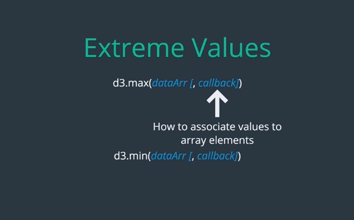
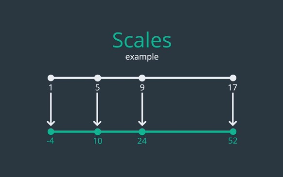
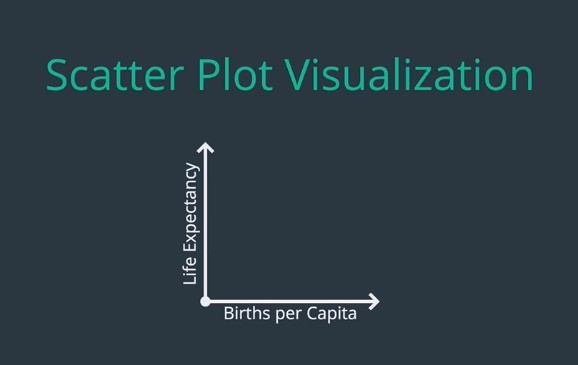
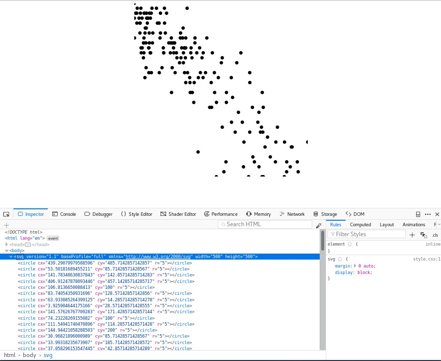
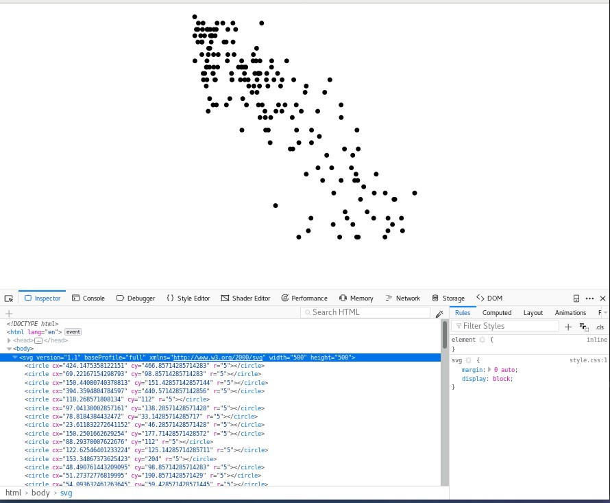
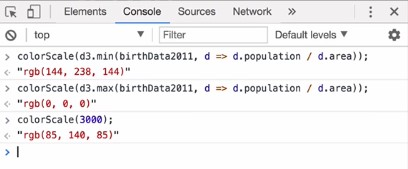
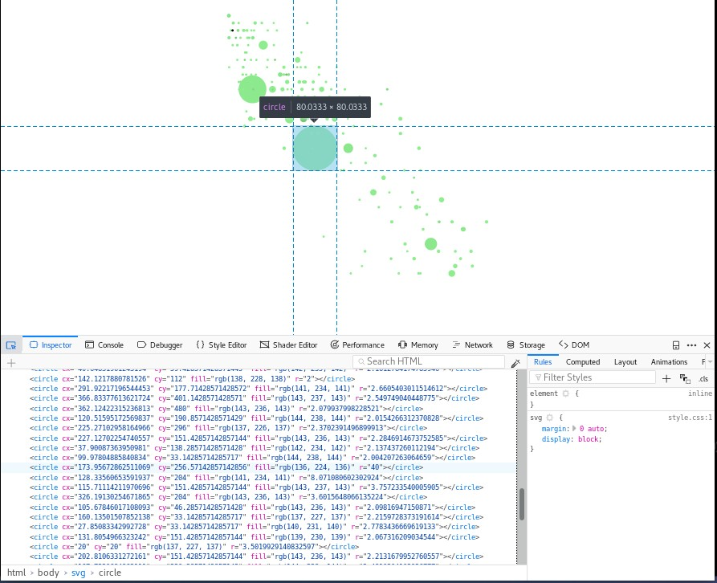

17, July 2018. Tue 21:17

## === OBJECTIVE ====

    1. Use D3 to calculate extreme Values in a data set
    2. Use D3 to scale data
    3. Build scatterplots using D3 and SVG
    4. Use D3 to add axes and gridlines to graphs
    5. Build histogram using D3 and SVG
    6. Build pie charts using D3 and SVG

### Extrema and Scales

Last time we build **D3 Birth Chart** to visualize births around the world by
month and by year. There are view issues came up when building this visualization
we have:

    1. Finding Extreme values manually
        - Inspect a data set find the first and last years.
        - Manually identify the largers value in data set.

    2. Scaling data manually
        - Doing arithmetic in order to make sure all of rectangle always fit inside the SVG

We will modifying the **app.js**. The first helper method we look at is **d3.max()**

#### Extreme Values

     d3.max(dataArr[,callback])

Which takes some array return the largest value in the array. You can also pass
in an optional callback specifying how you want to associate values to elements
in the array. This can extremely helpful if you have an array of object and want
to find a **max** value base on particular key.

Similarly there is **d3.min()** function which find the **smallest**
value instead the largest.

    d3.min(dataArr[,callback])

Here a view examples:

If I just past an array of number into **d3.max()** I get the max, and surprisingly
something similar happen when I use **d3.min()**, in this case I get the smallest
value instead the largest.

    d3.max([1,2,3,5,8,5])

    >> 8

    d3.min([1,2,3,5,8,5])

    >> 1

Now lets suppose I have an array of people object where each person has an **name**
and an **age**. If I want to find the largest **age** in my data-set I can use
**d3.max()** and pass in a callback to grab each person age. I can do something
similar if I want find the **shortest name** in the data-set.

    var people = [
      { name: "Breet", age: 40 },
      { name: "Mackenxie", age:30 },
      { name: "Arya", age: 73 },
      { name: "Lee", age: 22 }
    ];

    d3.max(people, function(d) {
      return d.age;
    });

    >> 78

    d3.min(people, function(d) {
      return d.name.length
    });

    >> 3;

Lets apply this function to refactor some of previous code. We can use **d3.max()**
to find the maximum value in our data-set rather then trying to eyeball it by
looking thru all of the values.

    var maxBirths = d3.max(birthData, function(d) {
      return d.births;
    });

We can also refactor our **minYear** and **maxYear** variables to use these D3
helper function.

    var minYear = birthData[0].year;
    var maxYear = birthData[birthData.length - 1].year;

Into:

    var minYear = d3.min(birthData, function(d) {
      return d.year;
    });

    var mmaxYear = d3.max(birthData, function(d) {
      return d.year;
    });

Or in ES6

    var minYear = d3.min(birthData, d => d.year);
    var maxyear = d3.min(birthData, d => d.year);

Once we know the maximum number of birth we can base our scale on it.

#### Scales

There are number of different scales you can use for your data, but the most common
is:

    d3.scaleLinear()
      .domain([num1. num2])
      .range([num3, num4])

**scaleLinear()** return a function that **map** value on the **domain** to value
on the **range**. Before applying this function to our visualization lets look at
an example:

Suppose I want to **map** values one interval, say from **1** to **17** to values
another interval said from **-4** to **52**. With some algebra I could write
a function that would **map** value on the first line to value on the second line,
but this is precisely what D3 scale on your task.

Here's the syntax, for the **domain** I pass an array **(1,17)** for the **range**
I pass another interval **(-4, 52)**. This scale will now map value is in the
**domain** to the value in the **range**.

    var scale = d3.scaleLinear()
                .domain([1, 17])
                .range([-4, 52]);

    scale(1);

    >> -4

    sclae(17)

    >> 52

Every value in between "1" to "17" get map to appropriate value

    var scale = d3.scaleLinear()
                .domain([1, 17])
                .range([-4, 52]);

    scale(5)

    >> 10

    scale(9)

    >> 24

    scale(10.23)

    >> 28.305

We can use **scaleLinear()**

    var yScale = d3.scaleLinear()
                  .domain([0, maxBirths])
                  .range([height, 0]);

There's one small change we made to the **scale** compare to previous example.
Note that we map **0** to SVG **height** and **maxBirths** to **0**. This has
effect of flipping the **y** axis, in this way **y** scale of **0** gets map
into the bottom of the SVG. This make reasoning about coordinates a bit easier
since after scaling **y** value increase when you go up not down. 

Now we've created **scale** lets use it to modify data so that the bars all fit
in SVG.

    d3.select("svg")
    .....
    .....
    .enter()
    .append("rect")
    ......
    ......
    .attr("height", function(d) {
      return d.births / maxBirths * height;
    })
    .attr("y", function(d) {
      return height - d.births / maxBirths * height;
    })
    ......

    d3.select(input)
      .on(input, function() {
      var year = d3.event.target.value;
      ......
      .....

      .attr("height", function(d) {
        return d.births / maxBirths * height;
      })
      .attr("y", function(d) {
        return height - d.births / maxBirths * height;
      })

Into:

    d3.select("svg")
    .....
    .....
    .enter()
    .append("rect")
    ......
    ......
    .attr("height", function(d) {
      return height - yScale(d.births);
    })
    .attr("y", function(d) {
      return yScale(d.births);
    })
    ......
    ......

    d3.select(input)
      .on(input, function() {
      var year = d3.event.target.value;
      ......
      .....
      .attr("height", function(d) {
        return height - yScale(d.births);
      })
      .attr("y", function(d) {
        return yScale(d.births);
      });

This code is  much flexible then what we have before. It's doesn't depend on the
specific set data-point, and if we decide to add or to remove data from data-set
later on we wont need to modify this code.

### Scatter Plots

Now we use what we learn about working with **min** **max** and **scale** with
D3 to build first **Scatter Plots**. In keeping with the theme lets grab some
more birth data.

This time around I've got data not only on birth but also in **population**,
**area** and **lifeExpectancy**. This data organize by region and this from **2011**
in file **birthData** in folder **Scatterplots**. Lets visualize this data with
scatter plots. On the **y** axis I want to measure **life expectancy** and on the
**x** axis I want some measurement of **birth**, rather then looking the number
of birth directly, I look it birth divide by **population** this will give me
a measurement a birth per **capita** rather then just the total number of birth.

In last lecture we learn to use various D3 method to help us work with data.
Here we need use those methods again. First lets create **scale** for **y** axis
in order to do that we calculate the **minimum** and **maximum** in **dataset**
since the **y** axis is measuring **life expectancy** this is the property we
need to return in callback function.

    var width = 500;
    var heght = 500;

    var yMax = d3.max(birthData2011, d => d.lifeExpectancy);
    var yMin = d3.min(birthData2011, d => d.lifeExpectancy);

Note that from here and out I use the **arrow** function for these callback where
I can. Once we've got **min** and **max** we can create **scale**, as in previous
lesson we mapping the **minimum** to the **height** and **maximum** to t**0**.

    var yScale = d3.scaleLinear()
                  .domain({yMin, yMax})
                  .range([height, 0]);

Before we move on it's worth mentioning a small refactor we can do here. There's
a term **code duplication** in our logic calculating **min** and **max** we
could pull callback out into it's own name function but we can also use D3 build
in **extent** function.

    d3.extent(dataArr[, callback])

Which calculate both minimum and maximum in data set and return both values to us
in an array. Here is quick example, in this case we've array of people and want to
know the range of ages, the **extent()** method will return to us an array with
both small stage and the largest one.

    var people = [
      { name: "Breet", age: 40 },
      { name: "Mackenxie", age:30 },
      { name: "Arya", age: 73 },
      { name: "Lee", age: 22 }
    ];

    d3.extent(people, d => d.age);

    >> (2) [22, 78]

We can call this function inside of **scale** domain method directly, the rest
all of code will be:

    var width = 500;
    var heght = 500;

    var yScale = d3.scaleLinear()
                  .domain(d3.extent(birthData2011, d => d.lifeExpectancy))
                  .range([height, 0]);

Now lets move on into **x** axis, here we want to do basically the same thing
just with the different scale, we want to return **d.birth** divided **d.population**
rather then **d.lifeExpectancy**

    var xScale = d3.scaleLinear()
                  .domain(d3,extent(birthData2011, d => d.births / d.poulation))
                  .range([0, width]);

Now lets make our first scatter-plot. First we set **width** and **height** of
SVG, then we create an empty selection of **circle** and **join** our data to it
after that will happen to the enter selection **append** the new **cirlce** and
begin to style them. The coordinate of the **circle** base on our **scale** for
now just to get something showing up on the page let set the **radius** width
circle to be **5**

    d3.select("svg")
        .attr("width", width)
        .attr("height", height)
      .selectAll("cirlce")
      .data(birthData2011)
      .enter()
      .append("circle")
        .attr("cx", d => xScale(d.births / d.population))
        .attr("cy", d => yScale(d.lifeExpectancy))
        .attr("r", 5);

Lets see the result:

One circle for each region. As you can tell there's fairly strong negative
association between **lifeExpectancy** and **birth-per-capita** the higher this
measurement of **birthRate** the lower the **lifeExpectancy**, so far so good.
But there are couple of issues of this visualization, one is the circle touch
the edge of SVG are getting cut-off because there center laying edge of the SVG.
The most common way to fix this problem is to set some **padding** for the SVG
and update our **scale** to account for this **padding**, now we have data-point
**min** or **max** it wouldn't be map off the corner of the SVG, but will be
off-set by our **padding** value.

    var width = 500;
    var heght = 500;
    var padding = 20;

    var yScale = d3.scaleLinear()
                  .domain(d3.extent(birthData2011, d => d.lifeExpectancy))
                  .range([height - padding, padding]);

    var xScale = d3.scaleLinear()
                  .domain(d3,extent(birthData2011, d => d.births / d.poulation))
                  .range([padding, width - padding]);

Lets add some more functionality, right now our scatter plot help us visualize
relationship between two variables **lifeExpectancy** and **birth-per-capita**,
but we can visualize even more relationship by adjusting other aspect of the **cirlce**.
Two other attributes we could adjust base on **data** or the **field** and the
**radius**, lets use this attributes to make our visualization a little more
interesting.

For the **fill** we adjust the **color** base on the **country population density**.
That's is **population** divided by it's **area**, lets color things so that **low**
density are green and **high** area are black, how can we do this? **scaleLinear**
its got that covered. It can do more map **numbers to numbers** it can also map
**numbers to colors**.

    var colorScale = d3.scaleLinear()
                      .domain(d3.extent(birthData2011, d => d.population / d.area))
                      .range(['lightgreen', 'black']);

This scale works by converting colors to **RGB** value so the smallest density
gets map to green and the largest gets map to black.

With this scale we can now adjust the **fill** base on the **population** density

    d3.select("svg")
        .attr("width", width)
        .attr("height", height)
      .selectAll("circle")
      .data(birthData2011)
      .enter()
      .append("circle")
        .attr("cx", d => xScale(d.births / d.population))
        .attr("cy", d => yScale(d.lifeExpectancy))
        .attr("fill", d => colorScale(d.population / d.area)) << add this
        .attr("r", 5)

Lastly lets use the **radius** to provide us with some more insight, I let the
**radius** on each **circle** be based just of the number of **birth** not on
the **birth-per-capita**, for this we need one more **scale**.

    var radiusScale = d3.scaleLinear()
                        .domain(d3.extent(birthData2011, d => d.births))
                        .range([2, 40]);

    d3.select("svg")
        .attr("width", width)
        .attr("height", height)
      .selectAll("circle")
      .data(birthData2011)
      .enter()
      .append("circle")
        .attr("cx", d => xScale(d.births / d.population))
        .attr("cy", d => yScale(d.lifeExpectancy))
        .attr("fill", d => colorScale(d.population / d.area)) << add this
        .attr("r", d => radiusScale(d.births)); << add this

Now our scatter plot help us to visualize relationship between four variables.
**births**, **birth-per-capita**, **lifeExpectancy** and **populationDensity**
