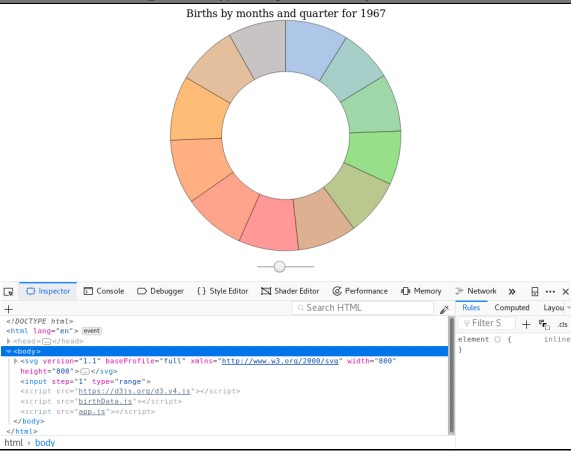

17, July 2018. Tue 21:17

## === OBJECTIVE ====

    1. Use D3 to calculate extreme Values in a data set
    2. Use D3 to scale data
    3. Build scatterplots using D3 and SVG
    4. Use D3 to add axes and gridlines to graphs
    5. Build histogram using D3 and SVG
    6. Build pie charts using D3 and SVG

## Extrema and Scales

Last time we build **D3 Birth Chart** to visualize births around the world by
month and by year. There are view issues came up when building this visualization
we have:

    1. Finding Extreme values manually
        - Inspect a data set find the first and last years.
        - Manually identify the largers value in data set.

    2. Scaling data manually
        - Doing arithmetic in order to make sure all of rectangle always fit inside the SVG

We will modifying the **app.js**. The first helper method we look at is **d3.max()**

#### Extreme Values

     d3.max(dataArr[,callback])

Which takes some array return the largest value in the array. You can also pass
in an optional callback specifying how you want to associate values to elements
in the array. This can extremely helpful if you have an array of object and want
to find a **max** value base on particular key.

Similarly there is **d3.min()** function which find the **smallest**
value instead the largest.

    d3.min(dataArr[,callback])

Here a view examples:

If I just past an array of number into **d3.max()** I get the max, and surprisingly
something similar happen when I use **d3.min()**, in this case I get the smallest
value instead the largest.

    d3.max([1,2,3,5,8,5])

    >> 8

    d3.min([1,2,3,5,8,5])

    >> 1

Now lets suppose I have an array of people object where each person has an **name**
and an **age**. If I want to find the largest **age** in my data-set I can use
**d3.max()** and pass in a callback to grab each person age. I can do something
similar if I want find the **shortest name** in the data-set.

    var people = [
      { name: "Breet", age: 40 },
      { name: "Mackenxie", age:30 },
      { name: "Arya", age: 73 },
      { name: "Lee", age: 22 }
    ];

    d3.max(people, function(d) {
      return d.age;
    });

    >> 78

    d3.min(people, function(d) {
      return d.name.length
    });

    >> 3;

Lets apply this function to refactor some of previous code. We can use **d3.max()**
to find the maximum value in our data-set rather then trying to eyeball it by
looking thru all of the values.

    var maxBirths = d3.max(birthData, function(d) {
      return d.births;
    });

We can also refactor our **minYear** and **maxYear** variables to use these D3
helper function.

    var minYear = birthData[0].year;
    var maxYear = birthData[birthData.length - 1].year;

Into:

    var minYear = d3.min(birthData, function(d) {
      return d.year;
    });

    var maxYear = d3.max(birthData, function(d) {
      return d.year;
    });

Or in ES6

    var minYear = d3.min(birthData, d => d.year);
    var maxyear = d3.min(birthData, d => d.year);

Once we know the maximum number of birth we can base our scale on it.

#### Scales

There are number of different scales you can use for your data, but the most common
is:

    d3.scaleLinear()
      .domain([num1. num2])
      .range([num3, num4])

**scaleLinear()** return a function that **map** value on the **domain** to value
on the **range**. Before applying this function to our visualization lets look at
an example:

Suppose I want to **map** values one interval, say from **1** to **17** to values
another interval said from **-4** to **52**. With some algebra I could write
a function that would **map** value on the first line to value on the second line,
but this is precisely what D3 scale on your task.

Here's the syntax, for the **domain** I pass an array **(1,17)** for the **range**
I pass another interval **(-4, 52)**. This scale will now map value is in the
**domain** to the value in the **range**.

    var scale = d3.scaleLinear()
                .domain([1, 17])
                .range([-4, 52]);

    scale(1);

    >> -4

    sclae(17)

    >> 52

Every value in between "1" to "17" get map to appropriate value

    var scale = d3.scaleLinear()
                .domain([1, 17])
                .range([-4, 52]);

    scale(5)

    >> 10

    scale(9)

    >> 24

    scale(10.23)

    >> 28.305

We can use **scaleLinear()**

    var yScale = d3.scaleLinear()
                  .domain([0, maxBirths])
                  .range([height, 0]);

There's one small change we made to the **scale** compare to previous example.
Note that we map **0** to SVG **height** and **maxBirths** to **0**. This has
effect of flipping the **y** axis, in this way **y** scale of **0** gets map
into the bottom of the SVG. This make reasoning about coordinates a bit easier
since after scaling **y** value increase when you go up not down. 

Now we've created **scale** lets use it to modify data so that the bars all fit
in SVG.

    d3.select("svg")
    .....
    .....
    .enter()
    .append("rect")
    ......
    ......
    .attr("height", function(d) {
      return d.births / maxBirths * height;
    })
    .attr("y", function(d) {
      return height - d.births / maxBirths * height;
    })
    ......

    d3.select(input)
      .on(input, function() {
      var year = d3.event.target.value;
      ......
      .....

      .attr("height", function(d) {
        return d.births / maxBirths * height;
      })
      .attr("y", function(d) {
        return height - d.births / maxBirths * height;
      })

Into:

    d3.select("svg")
    .....
    .....
    .enter()
    .append("rect")
    ......
    ......
    .attr("height", function(d) {
      return height - yScale(d.births);
    })
    .attr("y", function(d) {
      return yScale(d.births);
    })
    ......
    ......

    d3.select(input)
      .on(input, function() {
      var year = d3.event.target.value;
      ......
      .....
      .attr("height", function(d) {
        return height - yScale(d.births);
      })
      .attr("y", function(d) {
        return yScale(d.births);
      });

This code is  much flexible then what we have before. It's doesn't depend on the
specific set data-point, and if we decide to add or to remove data from data-set
later on we wont need to modify this code.

## Scatter Plots

Now we use what we learn about working with **min** **max** and **scale** with
D3 to build first **Scatter Plots**. In keeping with the theme lets grab some
more birth data.

This time around I've got data not only on birth but also in **population**,
**area** and **lifeExpectancy**. This data organize by region and this from **2011**
in file **birthData** in folder **Scatterplots**. Lets visualize this data with
scatter plots. On the **y** axis I want to measure **life expectancy** and on the
**x** axis I want some measurement of **birth**, rather then looking the number
of birth directly, I look it birth divide by **population** this will give me
a measurement a birth per **capita** rather then just the total number of birth.

In last lecture we learn to use various D3 method to help us work with data.
Here we need use those methods again. First lets create **scale** for **y** axis
in order to do that we calculate the **minimum** and **maximum** in **dataset**
since the **y** axis is measuring **life expectancy** this is the property we
need to return in callback function.

    var width = 500;
    var heght = 500;

    var yMax = d3.max(birthData2011, d => d.lifeExpectancy);
    var yMin = d3.min(birthData2011, d => d.lifeExpectancy);

Note that from here and out I use the **arrow** function for these callback where
I can. Once we've got **min** and **max** we can create **scale**, as in previous
lesson we mapping the **minimum** to the **height** and **maximum** to t**0**.

    var yScale = d3.scaleLinear()
                  .domain({yMin, yMax})
                  .range([height, 0]);

Before we move on it's worth mentioning a small refactor we can do here. There's
a term **code duplication** in our logic calculating **min** and **max** we
could pull callback out into it's own name function but we can also use D3 build
in **extent** function.

    d3.extent(dataArr[, callback])

Which calculate both minimum and maximum in data set and return both values to us
in an array. Here is quick example, in this case we've array of people and want to
know the range of ages, the **extent()** method will return to us an array with
both small stage and the largest one.

    var people = [
      { name: "Breet", age: 40 },
      { name: "Mackenxie", age:30 },
      { name: "Arya", age: 73 },
      { name: "Lee", age: 22 }
    ];

    d3.extent(people, d => d.age);

    >> (2) [22, 78]

We can call this function inside of **scale** domain method directly, the rest
all of code will be:

    var width = 500;
    var heght = 500;

    var yScale = d3.scaleLinear()
                  .domain(d3.extent(birthData2011, d => d.lifeExpectancy))
                  .range([height, 0]);

Now lets move on into **x** axis, here we want to do basically the same thing
just with the different scale, we want to return **d.birth** divided **d.population**
rather then **d.lifeExpectancy**

    var xScale = d3.scaleLinear()
                  .domain(d3,extent(birthData2011, d => d.births / d.poulation))
                  .range([0, width]);

Now lets make our first scatter-plot. First we set **width** and **height** of
SVG, then we create an empty selection of **circle** and **join** our data to it
after that will happen to the enter selection **append** the new **cirlce** and
begin to style them. The coordinate of the **circle** base on our **scale** for
now just to get something showing up on the page let set the **radius** width
circle to be **5**

    d3.select("svg")
        .attr("width", width)
        .attr("height", height)
      .selectAll("cirlce")
      .data(birthData2011)
      .enter()
      .append("circle")
        .attr("cx", d => xScale(d.births / d.population))
        .attr("cy", d => yScale(d.lifeExpectancy))
        .attr("r", 5);

Lets see the result:

One circle for each region. As you can tell there's fairly strong negative
association between **lifeExpectancy** and **birth-per-capita** the higher this
measurement of **birthRate** the lower the **lifeExpectancy**, so far so good.
But there are couple of issues of this visualization, one is the circle touch
the edge of SVG are getting cut-off because there center laying edge of the SVG.
The most common way to fix this problem is to set some **padding** for the SVG
and update our **scale** to account for this **padding**, now we have data-point
**min** or **max** it wouldn't be map off the corner of the SVG, but will be
off-set by our **padding** value.

    var width = 500;
    var heght = 500;
    var padding = 20;

    var yScale = d3.scaleLinear()
                  .domain(d3.extent(birthData2011, d => d.lifeExpectancy))
                  .range([height - padding, padding]);

    var xScale = d3.scaleLinear()
                  .domain(d3,extent(birthData2011, d => d.births / d.poulation))
                  .range([padding, width - padding]);

Lets add some more functionality, right now our scatter plot help us visualize
relationship between two variables **lifeExpectancy** and **birth-per-capita**,
but we can visualize even more relationship by adjusting other aspect of the **cirlce**.
Two other attributes we could adjust base on **data** or the **field** and the
**radius**, lets use this attributes to make our visualization a little more
interesting.

For the **fill** we adjust the **color** base on the **country population density**.
That's is **population** divided by it's **area**, lets color things so that **low**
density are green and **high** area are black, how can we do this? **scaleLinear**
its got that covered. It can do more map **numbers to numbers** it can also map
**numbers to colors**.

    var colorScale = d3.scaleLinear()
                      .domain(d3.extent(birthData2011, d => d.population / d.area))
                      .range(['lightgreen', 'black']);

This scale works by converting colors to **RGB** value so the smallest density
gets map to green and the largest gets map to black.

With this scale we can now adjust the **fill** base on the **population** density

    d3.select("svg")
        .attr("width", width)
        .attr("height", height)
      .selectAll("circle")
      .data(birthData2011)
      .enter()
      .append("circle")
        .attr("cx", d => xScale(d.births / d.population))
        .attr("cy", d => yScale(d.lifeExpectancy))
        .attr("fill", d => colorScale(d.population / d.area)) << add this
        .attr("r", 5)

Lastly lets use the **radius** to provide us with some more insight, I let the
**radius** on each **circle** be based just of the number of **birth** not on
the **birth-per-capita**, for this we need one more **scale**.

    var radiusScale = d3.scaleLinear()
                        .domain(d3.extent(birthData2011, d => d.births))
                        .range([2, 40]);

    d3.select("svg")
        .attr("width", width)
        .attr("height", height)
      .selectAll("circle")
      .data(birthData2011)
      .enter()
      .append("circle")
        .attr("cx", d => xScale(d.births / d.population))
        .attr("cy", d => yScale(d.lifeExpectancy))
        .attr("fill", d => colorScale(d.population / d.area)) << add this
        .attr("r", d => radiusScale(d.births)); << add this

Now our scatter plot help us to visualize relationship between four variables.
**births**, **birth-per-capita**, **lifeExpectancy** and **populationDensity**

## Axes and Gridlines

#### Axes

In this section we continue to improve the Scatter-plots we made by adding a **title**,
**axes** and **gridLines**. We know it's been visualize because we wrote the code
but imagine if you share this scatter-plot with friends of yours, they have no
idea what data is suppose to represent, there are no **labels** no **axes**,
there is no information of any kind on the page about what exactly we looking at,
lets fix that.

The firs thing we do create some **axes**, graph **axes** is difficult to draw
on your own, you need to draw a line representing the **axes** along with
**tick-marks** and **text-label** for each tick-marks.

Doing all this from scratch quit nor deal, fortunately D3 has method that would
to take care all busy work for you. There are four method D3 uses to create **axes**

    d3.axisTop(scale)
    d3.axisRight(scale)
    d3.axisBottom(scale)
    d3.axisLeft(scale)

All these method taken a **scale** and return an function that can generate an **axes**
in SVG. The method we choose determine where the **text-label** with sit relatively
to the **axes**.

    var radiusScale = d3.scaleLinear()
                        .domain(d3.extent(birthData2011, d => d.births))
                        .range([2, 40]);

Lets wipe out quick **x-axis** using **d3.axisBottom(scale)**.

    var xAxis = d3.axisBottom(xScale);

We pass in **xScale** this pattern is fairly to call, in order to get **axes**
to show up we need to call the **axes** function we've created on **d3.selection**.

    d3.select("svg")
      .append("g")
        .call(xAxis);

If we inspected using the elements tabs, we can see there's fair amount going on 
our axis inside of the group that we append it its got a **path** insisting the
main **axis** line along with **tick-marks** on other side, inside one of each
group we got a line for the **tick-marks** along with the **text-label**. The
position of our **axes** is little less then idle by default D3 append the
**axes** starting from the origin of the SVG that is upper-left corner. If we
want **axes** somewhere else we need to move our selves. Lets do that by setting
**transform** attributes with append it 

    d3.select("svg")
      .append("g")
      .attr("transform", "translate(0, " + (height - padding) +")")
        .call(xAxis);

Lets repeat this process with the **y** axis

    var yAxis = d3.axisLeft(yScale);

    d3.select("svg")
      .append("g")
        .attr("transform", "translate(" + padding + ", 0)")
        .call(yAxis);

If you like to add **gridLine** to improve readability of your graph you can do
that directly from the **axes**. The simple things to do change the size of the
**ticks** so they stretch across the SVG, the only catch is the graph area
takes padding into a count so the length of the **ticks** should to.

#### Gridlines

To adjust a link of the **ticks** we can use the **tickSize()** method, and pass
in desire length.

    axis.tickSize([size])

The ticks will stretch in the direction of the axis label, so for both of our axis
will want our **ticksizes** to be negative. For the **x** axis this will stretch
the **tick-up**. We want the total size will to be the negative value of the high
plus twice the padding.

    var xAxis = d3.axisBottom(xScale)
                  .tickSize(-height + 2 * padding);

We take very similar approach for the **y** axis

    var yAxis = d3.axisBottom(xScale)
                  .tickSize(-width + 2 * padding);

Note that the **tick-size** updates the link of the tick with **text-label** and
the ticks either in the end of the axis. If you don't want to adjust the ticks
either end of the axis you can set their links separately using the **tickSizeOuter()**
method.

    axis.tickSizeOuter([size])

    var xAxis = d3.axisBottom(xScale)
                  .tickSize(-height + 2 * padding)
                  .tickSizeOuter(0);

    var yAxis = d3.axisBottom(xScale)
                  .tickSize(-width + 2 * padding)
                  .tickSizeOuter(0);

Lets also add the styling of the **gridLines**, each **gridLines** is inside of
the group with a class of **tick**, so we select those lightning the **stroke**
color and make the lines dash using the **stroke-dasharray** property. The value
for **stroke-dasharray** property is **two** numbers, the **lenght** of the dash
and the **distance** between dashes.

    .tick line {
      stroke: #ccc;
      stroke-dasharray: 10, 5;
    }

Lets finish things up by adding some **label** to the axis and giving a graph
to a title. D3 doesn't provide us any secret sauce for adding this things. To
add these **text-label** we need just to go back to our D3 fundamental.

**Select** the SVG **append** the **text** element positioning correctly and set
**inner-text**. Here's how we can do that for the **x** axis label, here we
positioning the text element so that center horizontally and vertically align
with the **x** axis then we using the **dy** attributes to push it down relative
to **x** axis, finally we centering the text relative to the **x** attributes
and setting the text inside of it. We not doing much else to **style** these
elements fell free to add some style on your own, either using D3 **style**
method or in CSS file.

    d3.select("svg")
      .append("text")
        .attr("x", width / 2)
        .attr("y", height - padding)
        .attr("dy", "1.5em")
        .style("text-anchor", "middle")
        .text("Births per Capita");

Adding a tittle is very similar I bump up text a bit, but otherwise what we
doing is should look very similar that we just did.

    d3.select("svg")
      .append("text")
        .attr("x", width / 2)
        .attr("y", padding)
        .style("text-anchor", "middle")
        .style("font-size", "1.5em")
        .text("Data on Births by Country in 2011");

All is left now is the **y** axis, this little bit tricky because we need to
rotate the text **90** degrees, after the rotation we need to be careful with
**x** and **y** attributes since adjusting the **x** attributes well now move
the text element in the vertical direction, and adjusting the **y** attributes
will move the element in the horizontal direction. Getting positioning right can
take a bit guess and check, if you make a mistake take a look where the element
round-up using the elements tabs and adjust as necessary.

    d3.select("svg")
      .append("text")
        .attr("transform", "rotate(-90)")
        .attr("x", - height / 2)
        .attr("y", padding)
        .attr("dy", "-1.1em")
        .style("text-anchor", "middle")
        .text("Life Expectancy");

Eventually you should laying on code that looks something like this:

Its definitely a lot clearly now what a graph representing, there are further
enhancement we could make, but we stop right here for now.

## Scatterplot Exercise and solution

 Let me start with creating a variable for the **width**, **height** and **padding**.

    var width = 800;
    var height = 600;
    var padding = 50;

Now lets filter the data, I'm interested in four variables: **subscribersPer100**,
**AdultLiteracyRate**, **medianAge** and **urbanPopulationRate**. There for if
the country doesn't have data on one of these variable, I want to remove it from
my data-set. In order to remove incomplete from my data-set, I first create
a helper function call **mustHaveKeys()**, this function will take in an object
and will check weather the object has value for each the four keys that I'm
interested in. To do this I loop through my array of keys and check weather the
value for that keys my object is null, if it's I return false, but if the object
has none null value for each of these keys I return true.

    function mustHaveKeys(obj) {
      var keys = [
        "subscribersPer100",
        "adultLiteracyRate",
        "medianAge",
        "urbanPopulationRate"
      ];

      for (var i = 0; i < keys.length; i ++) {
        if(obj[keys[i]] === null) return false;
      }
      return true;
    };

I use this helper function by call in filter on **regionData** passing in this helper
and storing the result in a variable I call **data**.

    var data = regionData.filter(mustHaveKeys);

Our **data** variable will consist only of region that have data on each of four
variable I'm interested in. It's look like this is working. **regionData** has **195**
elements in it, but **data** has only **146** elements.

Lets keep going, next I setup my **scale**, I want to measure **literacy-Rate**
on the **x** axis and **cell-subscriber** on the **y** axis. So for the **x**
axis I create a linear scale with **d3.scaleLinear**, inside of the domain I use
**d3.extent()** to find smallest and largest literacy-Rate, since this value
should be map to SVG bans in **range** method I pass in an array start from
**padding** and goes up with **width** minus **padding**.

    var xScale = d3.scaleLinear()
                  .domain(d3.extent(data => d => d.adultLiteracyRate))
                  .range([padding, width - padding]);

Our **y** scale look very similar. I just need to make a few adjustment the key
I interested in inside the callback to **d3.extent** finally I change the **range**
so that I'm referencing the **height**, I also do the same trick before flip the
largest in smallest values, so the smallest data-point get map to the lowest
part of the SVG.

    var yScale = d3.scaleLinear()
                  .domain(d3.extent(data => d => d.subscribersPer100))
                  .range([height - padding, padding]);

As I mention before I also interested visualizing a couple more variables. I use
the **radius** visualize the **medium age** and I use the **fill** to visualize
the proportion of the region that leave in urban area. So I need two more **scale**
One for each this variables. For radius scale I pass in **range** from **5** to
**30**, for the fill scale I pass in **range** from **yellow** to **red**.

    var rScale = d3.scaleLinear()
                   .domain(d3.extent(data, d => d.medianAge))
                   .range([5, 30]);

    var fScale = d3.scaleLinear()
                   .domain(d3.extent(data, d => d.urbanPopulationRate))
                   .range(["green", "red"]);

Enough for the setup. Lets plot some **circle**, since I need a references for
a few places I start by selecting the SVG with D3 and storing the selection in
a variable. While I'm here I set up with **width** and **height**.

    var svg = d3.select("svg")
                  .attr("width", width)
                  .attr("height", height);

Next lets apply our common D3 pattern to add circle to the page. From the SVG
I select all circle join my data up into **enter()** selection append circle and
then set the attributes. For the **cx** and **cy** I already build a scale, so
I just need to use them inside the callback to **.attr()**, while I'm here
I also get each circle a **white** stroke so that easier to spot the circle when
they overlap.

    svg
      .selectAll("circle")
      .data(data)
      .enter()
      .append("circle")
        .attr("cx", d => xScale(d.adultLiteracyRate))
        .attr("cy", d => yScale(d.subscribersPer100))
        .attr("r", d => rScale(d.medianAge))
        .attr("fill", d => fScale(d.urbanPopulationRate))
        .attr("stroke", "#fff");

Lets refresh the page.

We not finish yet thought, I still need add some **labels** and **axes** this
pattern is should look the same early lecture on axes. To start I create a variable
call **xAxis** and store D3 axes as a value, I pass the **xScale** into **d3.axisBottom()**
then set the **tickSize()** and **tickSizeOuter()**.

    var xAxis = d3.axisBottom(xScale)
                  .tickSize(- height + 2 * padding)
                  .tickSizeOuter(0);

Next I'll do almost the same thing for the **y** axis, the only differences is
I use left-axis, and **tickSize** depend on width not the height.

    var yAxis = d3.axisLeft(yScale)
                  .tickSize(- width + 2 * padding)
                  .tickSizeOuter(0);

While I'm working on text let me also briefly add a style to the CSS file so my
grid-line wouldn't just a black line.

    .tick line {
      stroke: #ccc;
      stroke-dasharray: 10,5;
    }

Now append the **axes** to the page. For the **x** axis I grab the SVG append
new **group** transform it, so that it's at the bottom of the SVG and then call
the **xAxis**.

    svg.append("g")
        .attr("transform", "translate(0," + (height - padding) + ")")
        .call(xAxis);

Next I do the same similar with **y** axis, do I need to transform it a bit
differently.

    svg.append("g")
        .attr("transform", "translate(" + padding + ",0)")
        .call(yAxis);

Lastly lest add some text-labels, for the **x** axis I add the text label move
it to the bottom middle of the SVG bump it down just a little bit the **dy**
attributes center the text and add a label.

    svg.append("text")
        .attr("x", width / 2)
        .attr("y", (height - padding))
        .attr("dy", padding / 2)
        .style("text-anchor", "middle")
        .text("Literacy Rate, Aged 15 and Up");

For the **y** axis I append the text element, rotate it adjust the location,
center the element, and then add some inner text.

    svg.append("text")
        .attr("transform", "rotate(-90)")
        .attr("x", - height / 2)
        .attr("dy", padding / 2)
        .style("text-anchor", "middle")
        .text("Cellular Subscribers per 100 People");

Getting the **y** axis in the right position is little tricky so don't worry if
this take a couple tries. Lastly I add a title Once again I append a text label
and place it this time is in the top middle on the SVG, I bum up the size a bit
and then add a title.

    svg.append("text")
        .attr("x", width / 2)
        .attr("dy", "1em")
        .style("text-anchor", "middle")
        .style("font-size", "2em")
        .text("Cellular Subscriptions vs. Literacy Rate");

Lets take a look the result:

## Histograms

19, July 2018. Thu 13:55.

Histogram is a helper function it's can be useful for specific type of graph.
Histogram is a special type of **barChat** in which value in data-set place into
**bin**, the high of rectangle in histogram represent the number of data-point
in that bin. In this lecture we build the histogram to visualize **birth-data**
by region for specific year.

In order to bucket our data into a bin we need a histogram, I could go through
this data (birthData.js) create arrays of arrays base on year and base on
births-range I'm curious about and then plug that data. Fortunately I don't have
to do that work on my own, D3 comes with some build in method to help take some
work off to my plate. This process will look very similar to the way we build
bar-chart, but with one key different we will use **d3.histogram()** automatically
bucket our value into groups for us.

To get started lets setup **width** and **height** and **barPadding** we also
need to determine the width of rectangles in our histogram and create **y**
scale so that we can be sure that the bins all fit on SVG, but nor to do this we
need to know how many bins we have? And how many pieces of data will be in each
bin.

    var width = 600;
    var height = 600;
    var barPadding = 1;

### Generating a Histogram | d3.histogram()

    d3.histogram()

**d3.histogram()** is a function that return a function to us if we pass our
data-set to the function that is return, D3 will create bin from our values. If
we pass a histogram generator in array of numbers this process is automatic, but
more commonly our data will be array of objects, and in this case we need to
specify for D3 how it's should pulling data from each object in our array. For
this we can use the **value()** method on **d3.histogram()**

    histogram.value([value])

Which accept a callback that specified how D3 should maintained value from each
object. In our case I start by generating histogram and just for the first year
in our data-set.

To do this I use **d3.min()** to grab the first year, then I filter out any data
that doesn't come from this first year and store the filtered array in a variable
called **yearData**.

    var minYear = d3.min(birthData, d => d.year);
    var yearData = birthData.filter(d => d.year === minYear);

Now lets use the histogram generator, I create a variable called **histogram**
and set equal to the return value of **d3.histogram()** I also chain a call to
the **value()** method so that I can specify that I want histogram of births-counts.
Finally I pass my data into this histogram generator and store the result in
a variable called **bins**

    var histogram = d3.histogram()
                      .value( d => d.births);

    var bins = histogram(yearData);

Lets dig in into output of it. Has you can see **bins** is an array with two
elements on it each of this elements is again an array, this time the array have
a **birthData** in them. This array have to additional property **x0** and **x1**,
for instance the first array inside of bins consist of three data point, each one
have a birth total **161** the value of **x0** and **100000** the value of **x1**.
With the data place into bins we know now how many rectangle we need to draw and
what our **yScale** should be.

So lets calculate the width, we can also generate a **yScale** for the **births-counts**
using **scaleLinear()**, our **domain** will go from **0** to the length of largest
bin, and the **range** will go from SVG height to **0**.

    var barWidth = width / bins.length - barPadding;

    var yScale = d3.scaleLinear()
                  .domain([0, d3.max(bins, d => d.length)])
                  .range([height, 0]);

Next lets select the SVG set **width** and **height** and then join our data to
element with the class of **bar**, for each enter node will now append **group**
element, I'm doing this because I want two element in the SVG for each data-point,
a **rectangle** and **text** elements with the description of the data.

    var bars = d3.select("svg")
                  .attr("width", width)
                  .attr("height", height)
                .selectAll(".bar")
                .data(bins)
                .enter()
                .append("g")
                  .classed("bar", true);

Inside of each group lets now append our histogram rectangles. This pattern should
very similar with what we did when we first learn about **bar-chart**. I set the
**x** attributes so that each rectangles is **offset** by the bar width plus the
bar padding. For the **y** attributes we use our **scale**, similarly the **height**
will just be equal to the SVG height minus the scaled value. Finally the **width**
equal the **barWidth**, well I'm add it I also adjust the **fill**.

    bars
      .append("rect")
        .attr("x", (id, i) => (barWidth + barPadding) * i)
        .attr("y", d => yScale(d.length))
        .attr("height", d => height - yScale(d.length))
        .attr("width", barWidth)
        .attr("fill", "#9C27B0");

As I mention earlier there is a Ton of data from 1967, but already we can see the
most region that reported the data have relatively small number of births.

Before we move on, it worth pointing out that you very often see the histogram
created with help of **xScale** as well as **yScale**, weather you want to use
**xScale** totally up to you, but its very common and allows us to do a bit buzz
arithmetic involving our rectangles. It also allow us to fix a small issues to
the current approach. Right now both of our bars have same width even though the
second one spend a larger range of values then the first, so before adding text
labels lets quickly refactor what we have to use a **scale**.

I create a scale before defining **histogram function**. I have the scale go from
**0** to the largest value in the data set, and as we've seen before we have the
**range** go from **0** to the SVG **width**.

    var xScale = d3.scaleLinear()
                  .domain([0, d3.max(yearData, d => d.births)])
                  .range([0, width])

Once we have this scale we can avoid calculate the bar width directly, instead
we can use the **x0** and **x1** properties for each bin to calculate the
appropriate width. Specifically we can pass the **x0** into the scale to figure
out where the **x** coordinate of each bars should be. As for the width its
should be equal to the different between the scale value **x1** and scale value
of **x0** minus the **barPadding**

However the **barWidth** now more accurate they also look a little weird, it will
be better if we could simply generate **bins** that have approximately same range,
So the rectangle will automatically have similar width. There are few things we
could do to get our bars width consistent. First we can specify the domain of
our histogram using the **domain()** method.

### Generating a Histogram | d3.histogram.domain([domain])

    histogram.domain([domain])

This method is call in histogram generating method. Its allows you to specifies
the domain of values that you like to generator to use when it's create **bins**.
If you don't specifies domain the generator will default using the extent of
data-set.

Lets modified the domain so that uses the domain of our scale, this will helping
sure the first bin in the correct size. To avoid duplication we just call **.domain**
in our scale. This will get the domain we use when we originally created the scale.
We can overwrite the default **thresholds** or **ranges** in this bin using the
**tresholds()** method on the histogram generator method, we talk more about
this method in the next lecture. For now all you need to know is that you often
to see the **tick-marks** of the **xScale** use to overwrite the default **thresholds**,
we can get this **ticks** by calling **xScale.ticks()**, which just return an array
evenly a space intermediate values to us. Lastly you often see **rangeRound()** use
on the **xScale** instead of **range**, this method is very similar to the
**range()** method we've seen before, the only different it's make sure the width
all rounded to the nearest tall numbers.

    var xScale = d3.scaleLinear()
                  .domain([0, d3.max(yearData, d => d.births)])
                  .rangeRound([0, width]); << added this

    var histogram = d3.histogram()
                      .domain(xScale.domain()) << added this
                      .thresholds(xScale.ticks()) << added this
                      .value( d => d.births);

We can see there more rectangles then before. We talk more about controlling the
number of rectangle with the **thresholds()** method in the next lecture.For now
lets finish things up by adding the **text-labels** for each bar group. In our
labels lets include the **end-point** of the bin, lets also include **account**
of the number of **region** inside of the bin, this windup with a lot of text,
so I rotate the text **90** degrees and dealigned (dibagikan) up in the middle
of each bar and at the bottom of SVG, In practice adding the position right
probably takes some guess and check so don't worry if you don't get this exactly
right on the first try.

    bars
      .append("text")
        .text(d => d.x0 + " - " + d.x1 + " (bar height: " + d.length +")")
        .attr("transform", "rotate(-90)")
        .attr("y", d => (xScale(d.x1) + xScale(d.x0)) / 2)
        .attr("x", - height + 10)
        .style("alignment-baseline", "middle");

### Generating a Histogram | d3.histogram.thresholds([value])

    histogram.thresholds([value])

The **thresholds()** method can take in different type of input, if you know
exactly how you want to separate your data one options is to **pass in an array of
values** that will be use to set end-points for each **bins**, that what we've
done with **xScale.ticks()**, but you can also pass in any other values to create
the **thresholds**.

Here's an example of how would look the **threshold** **90000** births.

    var histogram = d3.histogram()
                      .domain(xScale.domain())
                      .thresholds([90000, 180000, 270000]) << change this
                      .value( d => d.births);

If you don't know how you want to put in your data into bins but you know you
want more a fewer bins then the default, you can also pass a single number into
your **thresholds**. If you do this D3 will try to create uniforms resize bins
base of the number you provide it. The number of bins it's makes will be roughly
the same as the value you pass in, but there's no guarantee to get exactly that
many.

With our current data-set for example if I pass in the number **5**, I get exactly
five bins

    var histogram = d3.histogram()
                      .domain(xScale.domain())
                      .thresholds(5)  << 5 bins
                      .value( d => d.births);

But if I pass number **8**, I still get five bins. Here's the break down how
many bins I get for different values pass in thru the **thresholds()**. Basically
when you pass a number into **thresholds** D3 will do the best to accommodate you,
but there's no guarantee you get the exact **number of thresholds** you've request it,
If you need exact account use an array, not a single number.

### Scales Revisited | scale.ticks([count])

    scale.ticks([count])

The **ticks()** method on a scale behave a similar way, in that you can pass in
a number to specify how many values from the scales domain you like to receive
as intermediate values. D3 will do it the best to accommodate you, but you not
guarantee to get the exact number of values you specified.

For example you can see when I call **.ticks()** in **xScale** and pass in **5**
I get an array with **6** elements, but the same is true if I pass in **8**.

Okay lets move on to the next piece important functionality, being able to adjust
the year. To start in HTML I create a tag for **range input** and give the **step**
size of **1**.

    <input type="range" step="1"/>

In my JavaScript file, I first remove **barWidth** variable since I no longer needed.
Next I calculate the maximum year using **d3.max()**.

    var maxYear = d3.max(birthData, d => d.year);

After that I then use the **minYear** and the **maxYear** from **birthData** to
set a **min**, **max** and initial **Value** for our **range** input. Now lets
add event-listener to input, on input events I want to grab the new **year** and
update histogram accordingly. But since the number of bins I have make changes
I need to use **general update pattern** to update the graph, first I filter my
data-set by the new **year**, then I need to update the domain of my **xScale**
base on this new data.Once I've updated my scale, I can update the histogram
generator and in turn I can update the **bins**, once I've done that I can then
update the **yScale**. Next I can grab the **update selection** and begin to update
the graph.

Lets review the **general update pattern**, first we can remove any
elements in the **exit** selection. Next for any **enter** nodes we need to
append a new **group** and to each new group we need to append a **rectangle**
and the **text** elements, because I need to append twice I'm storing my
**enter** selection in a variable called **g**, finally we need to **merge**
enter selection with our update selection and update the rectangle and the text
for each bars. The attributes that we updating will be the same as the one when
we initial create the histogram, in fact there's fair amount code duplication
here.

    d3.select("input")
        .property("min", minYear)
        .property("max", maxYear)
        .property("value", minYear)
        .on("input", function() {
          var year = +d3.event.target.value;
          yearData = birtData.filter(d => d.year === year);
          xScale.domain([0, d3.max(yearData, d => d.births)]);
          histogram.domain(xScale.domain())
                   .thresholds(xScale.ticks());
         bins = histogram(yearData);
         yScale.domain([0, d3.max(bins, d.length)]);
         bars = d3.select("svg")
                  .selectAll(".bar")
                  .data(bins);

          // GENERAL UPDATE PATTERN REVIEW
        bars
          .exit()
          .remove()

        var g = bars
                  .enter()
                  .append("g")
                    .classed("bar", true);

        g.append("rect");
        g.append("text");

        g.merge(bars)
            .select("rect")
              .attr("x", (d, i) => xScale(d.x0))
              .attr("y", d => yScale(d.length))
              .attr("height", d => height - yScale(d.length))
              .attr("width", d => xScale(d.x1) - xScale(d.x0) - barPadding)
              .attr("fill", "#9C27B0");

        g.merge(bars)
            .select("text")
              .text(d => d.x0 + " - " + d.x1 + " (bar height: " + d.length +")")
              .attr("transform", "rotate(-90)")
              .attr("y", d => (xScale(d.x1) + xScale(d.x0)) / 2)
              .attr("x", - height + 10)
              .style("alignment-baseline", "middle");
        });

## Histogram Exercise and Solution

We set variable for SVG **width** and **height** as well some value for the SVG
**padding** and **barPadding**, Also similar to scatter-plot lecture I don't
wanna consider any data in my **regionData** array with the value **medianAge**
is null, so I filter my original data-set, so I only keep data on region that
only have record **medianAge**.

    var width = 800;
    var height = 600;
    var padding = 50;
    var barPadding = 1;
    var ageData = regionData.filter(d => d.medianAge !== null);

Moving on lets create some **scale**, I start with the **xScale** for my **domain**
I want the extreme values for **medianAge**, so once again I use **d3.extent**
then I use **rangeRound** end off the **padding** to the **width minus the padding**.

    var xScale = d3.scaleLinear()
                  .domain(d3.extent(ageData, d => d.medianAge))
                  .rangeRound([padding, width - padding]);

I can't set the **yScale** without knowing how high my bins will be, so first
I need to use **histogram generator** to create my bins, just like the example
we walk thru earlier in the section I set my **domain** on histogram equal to
the domain of my scale, and set **tresholds** base on the default **ticks** for
my scale, I also use the **value()** method on the generator to specify that
I wanna histogram of **medianAge** values.

    var histogram = d3.histogram()
                      .domain(xScale.domain())
                      .thresholds(xScale.ticks())
                      .value(d => d.medianAge);

Next I can define **bins** variables and set equal to the value I get when
I pass my **ageData** to the histogram generator.

    var bins = histogram(ageData);

Lets open the console and take look this variable.

Great, it's look that histogram generator work as expected. Now that I know how
many data-point on each bins I can create my **yScale**. For the **domain** I go
from  **0** to the **largest bins height**, and for the **range** I go from the
**height minus the padding** to the **padding**.

    var yScale = d3.scaleLinear()
                  .domain([0, d3.max(bins, d => d.length)])
                  .range([height - padding, padding]);

Lest quickly add **rectangles**, no secret here. I just use the same pattern
that we use many time before. First let me select the SVG set **width** and **height**
and store the selection in a variable.

    var svg = d3.select("svg")
                .attr("width", width)
                .attr("height", height);

Then I **selectAll** variables inside the SVG join with my **bin** data,
**enter**, **append** the rectangle and **style** them. My **x** attributes is
determine by **0x** property by each bins or in convention called **x0**. The
**y** attributes is determine by the **length of the bins**. The **height** and
the **width** bit more complicated, but this the same expression we've seen before.
Lastly I make all this rectangles **blue** with **fill** attributes.

    svg.selectAll("rect")
      .data(bins)
      .enter()
      .append("rect")
          .attr("x", d => xScale(d.x0))
          .attr("y", d => yScale(d.length))
          .attr("height", d => height - padding - yScale(d.length))
          .attr("width", d => xScale(d.x1) - xScale(d.x0) - barPadding)
          .attr("fill", "blue");

I also need to set my **axes** and **labels** we've done several time all ready.
So I just paste in the code.

    svg.append("g")
        .attr("transform", "translate(0," + (height - padding) + ")")
        .classed("x-axis", true); << added this

    svg.append("g")
        .attr("transform", "translate(" + padding + ", 0)")
        .classed("y-axis", true); << added this

    svg.append("text")
        .attr("x", width / 2)
        .attr("y", height - 10)
        .style("text-anchor", "middle")
        .text("Median Age");

    svg.append("text")
        .attr("transform", "rotate(-90)")
        .attr("x", - height / 2)
        .attr("y", 15)
        .style("text-anchor", "middle")
        .text("Frequency");

The only things I do slightly differently I added **class x-axix** to my x-axis,
and **class y-axis** to my y-axis. This will make my **axes** is easier to
select D3 when I need to update them as part of the bonus (this is the hint).
Now lets refresh the page, there is our histogram!!.

Next lest tackle the bonus, I like to add range input to the page so then I can
specify how many bins I want for the histogram. Firs I update my HTML to include
a **range input**, the fewest number of bins I can have is **1** and the step
size should also be **1**, I also set the **max** to **50**, but I set the value
property in JavaScript.

    <input type="range" min="1" step="1" max="50" />

Well I'm here I also add **p** tag with the class **bin-count**, this is how to
display to the user the current number of bins.

    

I also style new element in stylesheet.

    svg, input {
      margin: 0 auto;
      display: block;
    }

    bin-count {
      text-align: center
    }

Lets back to JavaScript and select the **input** element. The current value for
the input just be the number of the current bin that histogram generator create it.
Now that I have setup my input lets add **eventListener** for input event.

Inside of the callback I first store the input value call **bin-count**, then I update
the histogram generator, I put bin count into **ticks** method to change the array
that's been use to set the **thresholds**, this mean I need to update **bins**
variable and the **yScale domain** too since my bin has are changing, after that
I select the **y** axis and pass it into my updated scale.

Next lets Update the rectangles here again we see the general update pattern
come in to play, first I store the update selection in a variable then I remove
anything in **exit** selection, after that I append the rectangle for every
**enter** node for every on the **enter** selection and I **merger** in **update**
selection to set style for every rectangle on the page, then I update the **text**
on the **p** tag, then I update the **text** in the **p** tag.

    d3.select("input")
        .property("value", bins.length)
        .on("input", function() {
          var binCount = +d3.event.target.value;
          histogram.thresholds(xScale.ticks(binCount));
          bins = histogram(ageData);
          yScale.domain([0, d3.max(bins, d => d.length)]);

          d3.select("y-axis")
              .call(d3.axisLeft(yScale))

          var rect = svg
                      .selectAll("rect")
                      .data(bins);

          rect
            .exit()
            .remove();

          rect
            .enter()
              .append("rect")
            .merge(rect)
              .attr("x", d => xScale(d.x0))
              .attr("y", d => yScale(d.length))
              .attr("height", d => height - padding - yScale(d.length))
              .attr("width", d => xScale(d.x1) - xScale(d.x0) - barPadding)
              .attr("fill", "blue");

          d3.select("bin-count")
              .text("Number of bins: " + bins.length );
          });

This look legit, that would be nice that the **x-axis** adjust it with the
**barWidth**, to make this happen I can select the **x-axis** inside the **callBack**
then call new **axisBottom** where I use the **ticks()** method the axis pass in
**binCount**.

      d3.select(".x-axis")
        .call(d3.axisBottom(xScale)
                .ticks(binCount));

like look the **ticks()** method on the scale this will set the **ticks** on the
axis base on the count I've pass in, now the **x-axis** is updating to.

Note that the **x-axis** label get little cramp when the number bins is large,
one way to fix that to select all **text** element inside the **x-axis** and
update their styles, for example to make them bit more legible I can nudge them
a little in the **x** and **y** direction, **rotate** them and update their
**text-anchor** property. If we save and refresh we see thing now look little
better when there are large number of **bins**.

      d3.select(".x-axis")
        .call(d3.axisBottom(xScale)
                .ticks(binCount));
        .selectAll("text")
          .attr("y", -3)
          .attr("x", 10)
          .attr("transform", "rotate(90)")
          .style("text-anchor", "start");

One last thing the app look fine, but the code can use little refactoring, I get
fair mount duplication for the **syling of rectangles** and calling the **axes**,
if this duplication bothers you one thing we can do is refactor the common task
in to **one function**.

For example I could write a function called **updateRects** which is basically
responsible for updating the graph. This function will take is argument the
number of rectangles you want to draw. Inside of this function I create my
**xScale**, my **histogram-generaor**, my **bins**, and my **yScale**, then
I update the **x** and **y** axis use the general update pattern to update the
**rectangles** and update the **text** in a **p** tag.

    function updateRects(val) {

      var xScale = d3.scaleLinear()
                     .domain(d3.extent(ageData, d => d.medianAge))
                     .rangeRound([padding, width - padding]);

      var histogram = d3.histogram()
                        .domain(xScale.domain())
                        .thresholds(xScale.ticks())
                        .value(d => d.medianAge);

      var bins = histogram(ageData);

      var yScale = d3.scaleLinear()
                    .domain([0, d3.max(bins, d => d.length)])
                    .range([height - padding, padding]);

      d3.select("y-axis")
          .call(d3.axisLeft(yScale));

      d3.select(".x-axis")
        .call(d3.axisBottom(xScale)
                .ticks(binCount))
        .selectAll("text")
          .attr("y", -3)
          .attr("x", 10)
          .attr("transform", "rotate(90)")
          .style("text-anchor", "start");

      var rect = svg
                  .selectAll("rect")
                  .data(bins);

      rect
        .exit()
        .remove();

      rect
        .enter()
          .append("rect")
        .merge(rect)
          .attr("x", d => xScale(d.x0))
          .attr("y", d => yScale(d.length))
          .attr("height", d => height - padding - yScale(d.length))
          .attr("width", d => xScale(d.x1) - xScale(d.x0) - barPadding)
          .attr("fill", "blue");

      d3.select(".bin-count")
          .text("Number of bins: " + bins.length);
    }

With this helper the callback to my own method is much simpler. All I do is call
this helper and pass in the event target value as a number.

    d3.select("input")
        .property("value", bins.length)
      .on("input", function() {
        updateRects(+d3.event.target.value);
      });

I can also use this function to initially setup the graph, the first time
I generate the histogram I get **16** bins so let me store this number in
a variable.

    var initalBinCount = 16;

I can use this variable when I setup my input and again to call my helper
function, this save me from having to initial all my **x** and **y** axis, or
declare my **scale**, **histogram generator**,or **bins** variable outside of
this helper.

    d3.select("input")
        .property("value", initalBinCount)
      .on("input", function() {
        updateRects(+d3.event.target.value);
      });

    svg.append("g")
        .attr("transform", "translate(0," + (height - padding) + ")")
        .classed("x-axis", true)
        .call(d3.axisBottom(xScale)); << delete this line

    svg.append("g")
        .attr("transform", "translate(" + padding + ", 0)")
        .classed("y-axis", true)
        .call(d3.axisLeft(yScale)); << delete this line

        updateRect(initalBinCount);

When I save and refresh everything work as before, but this code has much less
duplication.

## Pie Charts

Pie charts is a valuable way to visualize data when you care about a part in
relation to a whole. You may recall that you can draw any circular **arcs** with
the SVG **path** element, which is what we need to draw a **pie-chart**, however
while the **path** element is a powerful drawing tool it's also not the most
intuitive, fortunately just D3 has **histogram** method it's also have a **pie**
method to help transform data for visualization as a **pie chart**.

In **birthData.js** I have an array of object that have **continent** data,
I like use this data to display a pie-charts for birth data by year. I all ready
put some code on my **app.js**, much of it's should look similar to what we have
for the histogram visualization.

I'm binding the **first year** in data set, fix-in bound on my SVG and filtering
out any data that isn't form the first year on my set.

    var minYear = d3.min(birthData, d => d.year);
    var width = 600;
    var height = 600;
    var yearData = birthData.filter(d => d.year === minYear);

Let me start by iterating through my data and generating a list of all **continent**
code. I could do this using the **reduce** or even by **inspection** since there
aren't many continents, but for now I just write q quick for-loop. Inside the
loop I use **indexOf** to check weather I've seen the continent or not, if not
I push it into my array.

    var continents = [];
    for (var i = 0; i < birthData[i].length; i++ {
      var continent = birthData[i].continent;
      if (continents.indexOf(continent) === -1) {
        continents.push(continent);
      }
    })

Now I also like to associate each continent a color. I could use an object but
this time I use **d3.scale** to get job done. The scale I'll use this time is
called **ordinal scale**.

### Scales Revisited | d3.scaleOrdinal()

Which basically map a discrete set of point on a **domain** to discrete set of
point in a **range**.

In this case my **domain** is **continent arrays**, for the range I need array
of colors, I could pick colors on my own, but D3 also comes with few different
colors schemes that their design work with **ordinal scale**. You can see a list
of schemes on D3 documentation for scales. For now since I know there aren't no
many continents I use **d3.schemeCategory10** which give me a **10** colors. Since
there fewer maintain continent the extra colors simply wont get use by the scale.

    var colorScale = d3.scaleOrdinal()
                      .domain(continents)
                      .range(d3.schemeCategory10);

Before we dig in to the D3 helper method **pie-chart** I like to do one more
setup. Typically **pie-chart** is build inside **group** elements which is transform
wherever you want the **center** of pie-chart to be. If you don't do this the
center of pie-chart will be the origin of the SVG which mean you only be able to
see **1/4** (one-quarter) of it.

So first I select the SVG set **width** and **height** then **append** the **group**
**transform** it to the center of the SVG and give a class of **chart** so that
easily I can selected later.

    d3.select("svg")
        .attr("width", width)
        .attr("height", height)
      .append("g")
        .attr("transform", "translate(" + width / 2 + ", " + height / 2 +")")
        .classed("chart", true);

Now we ready to learn a new D3 method, like histogram method we saw in previous
lecture there are a couple helper method we can use to stream line the process of
creating our **pie-chart**. The main difficulty lies on fact that as we've seen
**path** element on the SVG are complicated. So we need a way to translate between
our original set of data and the string that we could pass into the **attributes**
of **path** elements. D3 facilitate this transition with the help **2** methods.

### Pie Charts Helpers | d3.pie()

The first is:

    d3.Pie()

**d3.pie** is similar to **d3.histogram**, in that return a function which takes
a set of data and transform that data into a format that more useful for drawing
a graph. Also like **d3.histogram**, **d3.pie** has a value method that allow
you to specify the value you interested in visualizing.

Like before we want to specify the births property and pass in the data from
**1967**.

    var arcs = d3.pie()
                .value(d => d.births)
                (yearData);

To understand what D3 is doing let take a look the value of **arcs**, as you can
see I got an array of 4 objects, one for each **arch** in a **pie-chart**, each
object has have information about the arcs, **data** point is back to the data-object
from our original birth-data array that is bound to this particular **arc**.
**endAngle** is the angle where the arc should stop, **index** is keeps tracks
the short order of the arcs. The default **ordering** is by **value**, **the
larger the value the lower the index**. We talk about **padAngle** in the next
lecture. **startAngle** is the angle where the arcs should start. **value** is
value being graph. In this case the value is coming from fact that **Puerto Rico**
reported that many birth from in **1967**.

Note that the angle are always measure the radians which go from **0** to
**2 * pie**, where around **6.28**. **2 pi radians** is equal to **360** degree
both represent full rotation.

In this example, we see the first two **arc** should take up the most area, the
last arc may not be visible since the **stratAngle** and **endAngle** are so
close together. As you can see D3 takes care the work of translating our data
into **angle** values that we can **use** to draw a chart, but we not quit there
yet. How do we get from this object to a string that we can pass in as D3 attributes
to a **path** elements? Once again D3 has got our backs, it's also with
**arc()** method.

### Pie Chart Helper | d3.arc()

    d3.arc()

**d3.arc()** translate the JavaSCript object into valid SVG **path** commands.

Here is quick example, if I pass in an object with **innerRadius** of **0** and
**outerRadius** of **100**, a **startAngle** of **0** and **endAngle** of pi-radians
here's the string that **d3.arc()** will return to me.

As you can see this is the valid string which I could pass in as **d** attributes
to some path element.

We can also use special method on **d3.arc** to set default for some of this
object property. This can be helpful if for example when you know the
**inner-outer radius** that would be the same for every **arc**.

For instance here you can set to fix **inner-outer radius** for **d3.orc** base
on the width of SVG. Note that if you set the **innerRadius** to **0** you get
a circle and if set it into some **positive** value, you get a null less or
doughnut shape, so I get **positive** on radius.

    var path = d3.arc()
                .outerRadius(width / 2 - 10)
                .innerRadius(width / 4);

Now we need to use D3 data method to bind our **arc** to the SVG element. I've
already created the group of class **.chart** so first I select this group and
then I create an empty selection and by selecting all elements with the class of
an **.arc**. After joining with my **arcs** I hub in into the **enter** selection
and for each arc I **append** the **path** with the class of **arc**, I set the
**fill** base on the **continent** give each arc a **strok** color of black and
lastly I set **d** attributes on the **path** by simply pass in my path function.
Remember that since **path** is a function it would be invoke **once** for each
object in **arcs array** and it will return a valid path command. Now if we
refresh the page we can see our graph.

Now, we learn to get **range** and **footworking**, so we can see our data changes
over time, I also like to talk a few enhancement we ca make to our **pie-chart**
with D3.

First lets tackle the **range input**. To start I calculate the **maximum year**
using D3.

    var maxYear = d3.max(birthData, d => d,year);

This allow me to set a **min**, **max** and **value** property on the input with
JavaScript. Next I like to add an **eventListener** for **input** event on the
**rangeInput**. Here's I would to do thing bit differently.

    d3.select("input")
        .property("min", minYear)
        .property("max", maxYear)
        .proprety("value", "minYear")

As you may recall from histogram lecture I ended up with fair amount duplication
between the code that **setup** the graph and the code that **updated** the graph
inside my **eventHandler**. In the solution lecture "Histogram Exercise-and-Solution"
we write one way to avoid this duplication was to write a **helper function** that
responsible for **rendering** the graph using the **general update pattern**, So
that I would like to do here.

I write a function called **makeGraph** which takes a **year** as it argument.
Inside in this function I move the code that filter my data-set that only value
matching the year variable are kept. I also move my code that use **d3.pie** and
**d3.arc** into this function.

In the last lecture we only need to use **enter** selection to get our graph to
show up, but in order to make our code more flexible we need to use the **general
update pattern** as we've seen before I first need to grab the update selection
and store it into a variable.

Then I hub into **exit** selection and remove any unnecessary **arcs**. Next
I move into **enter** selection **append** the **path** element for each new
piece of data and give a **new arc**  a class of **arc**, finally I merge the
**enter** and **update** selection and set each arc **fill**, **stroke** and
**d** attributes, just like before.

    function makeGraph(year) {
      var yearData = birthData.filter(d => d.year === year);

      var arcs = d3.pie()
                  .value(d => d.births)
                  (yearData);

      var path = d3.arc()
                  .outerRadius(width / 2 - 10)
                  .innerRadius(width / 4);

      var update = d3.select(".chart")
                      .selectAll(".arc")
                      .data(arcs);

      update
        .exit()
        .remove();

      update
        .enter()
        .append("path")
          .classed("arc",true)
        .merge(update)
          .attr("fill", d => colorScale(d.data.continent))
          .attr("stroke", "black")
          .attr("d", path);
    }

Now that I have this function, I can use in two places, first I use it when
script load and pass in **minYear**.

    makeGraph(minYear);

Second I can use this function in **eventHendler** and pass in the event target
value converted into a number.

    d3.select("input")
        .property("min", minYear)
        .property("max", maxYear)
        .proprety("value", "minYear")
        .on("input", function() {
          makeGraph(+d3.event.target.value);
        });

Great this **range input**  seems to be working, there are a couple small enhancement
can make to our graph as well. If you want to set padding between **wedges**,you
can set it either in **d3.pie()** or **d3.arc**. On **d3.arc** you can **round**
your **corner** between wedges, which can be nice enhancement if you using padding

take a look this two line change our graph.

    var path = d3.arc()
                .outerRadius(width / 2 - 10)
                .innerRadius(width / 4)
                .padAngle(0.02) << add this line
                .cornerRadius(20); << add this line

Also it's important to note that you can change the default sort order for your
arcs, we've learn that the **pie generator** automatically sort arcs value,
largest arcs come first, but if you want sort by other value, you can use the
**sort()** method on the generator and pass in your own **comparator**.

### Sorting Arcs | pie.sort()

    pie.sort([comparator])

The sort method will run over pairs data points call them **a** and **b**. If
**a** should come **before** **b** chart the comparator should return the **negative**
number, if **a** should come **after** **b** the comparator should return the
**positive** number, but if you in different between **a** and **b** the
function should return **0**.

Here's the quick example, suppose you want to visualize your data group by
**continent** and then by **birth count**, we could use the **sort** method and
pass an comparator that check the property on **a** and **b**, if **a**
continent come before **b** alphabetically this comparator should return **-1**,
if **a** continent come after the comparator should return **+1**, otherwise the
two data point have the same continent and we can simply return the different in
**birth count**.

    var arcs = d3.pie()
                .value(d => d.births)
                .sort(function(a, b) {
                  if (a.continent < b.continent)
                    return -1;
                  else if (a.continent > b.continent)
                    return 1;
                  else return a.births - b.births;
                })
                (yearData);

As you can see now all the arcs of the same colors come together.

## Pie Charts Exercise and Solution

In last lecture, you remember that I recommended build a chart in **3 stages**.
**First** build the chart for single year, **Second** get the range input
working so you can change the year, **third** add the inner chart to choose data
by quarter rather then by month. Lets walk through the solution in this stages.

### First Stage

First I build the pie chart for data-set, like early lecture on **pie charts**
I begin by setting SVG **width**, **height** and by calculating the minimum year
on my data-set.

    var width = 600;
    var height = 600;
    var minYear = d3.min(birthData, d => d.year);

Eventually I like to color code each one on my arcs for prepare
this I build an **ordinal scale** to convert month to color, to do this let me
first create in array of months. This array will be important later on because
the month serve a range in chronological order.

    var orderedMonths = [ "January", "February", "March", "April", "May", "June",
      "July", "August", "September", "October", "November", "December" ];

Next I create an array of color, this color is base on **d3.schemeCatagory20**
but include color that are not part that scheme.

    var colors = [
      "#aec7e8", "#a7cfc9", "#9fd7a9", "#98df8a", "#bac78e", "#ddb092",
      "#ff9896", "#ffa48c", "#ffaf82", "#ffbb78", "#e4bf9d", "#c9c3c3"
    ];

Once I have this two arrays I can create a **color scale** using **scaleOrdinal**
method. My months will be the **domain**, and my color will be the **range**.

Lets happen to the console test the scale out.

    var colorScale = d3.scaleOrdinal()
               .domain(orderedMonths)
               .range(colors);

As you can see the first month is map to the first color, the second month map
to the second color and so on

Next lets take care some basic setup for the **chart**, first I select the SVG
set it **width** and **height** and store it in variable.

    var svg = d3.select("svg")
                  .attr("width", width)
                  .attr("height", height);

Then I append the group into SVG that will be the bases for my chart. Just like
we've seen before I center this group and give it a class so that I can easily
target it later.

    svg
      .append("g")
        .attr("transform", "translate(" + width / 2 +", "height / 2 +")" )
        .classed("chart", true);

I also append the **text** element to the top of SVG I added a **class** to it,
**center** it, and **style** little bit.

    svg
      .append("text")
          .classed("title", true)
          .attr("x", width / 2)
          .attr("y", 30)
          .style("font-ize", "2em")
          .style("text-anchor", "middle");

In order to reduce code duplication, I like to write a function for responsible
to **drawing** a graph. This might seem overkill now but it will be a life safer
when we want to get **range input** working. So I write a function called
**drawGraph** which take a **year** as an argument. Base on the year I **filter**
my data set.

I also setup my **pie chart helpers**, I create a variable call **arcs** and
assign a value base on **d3.pie** I use the **value** method to specify I want
to **grab births**, and I use **sort** method to sort my arcs. Here I want to
sort things chronologically, so I use index of the month and order month array
to determine my sort order.

After that I create **path** function using **d3.arc** since I know I'll add
inner cart later, for now I set the **innerRadius** to be positive.

Now I select my **chart** group create an empty selection and join the data I get
back when I pass my year data into the **.arc** function. I store this in
variable called **outer** since it the **outer cart**.

One thing that's nice about this chart is that the number of **arc** is always
the same, so I never have to hub into exit selection. Instead for any new
**arcs** I add a class of **arcs** and set the **fill** for the **merge**
selection I just need to update **d** attributes. Note this **enter** selection
only matters the first time I draw a graph. After that the **update** selection
is the only one that will have anything in it.

Finally I update the **text** and the **title**, I do it here rather then one
originally appended the text elements so that I can avoid some duplication when
I need to update the text.

    function drawGraph(year) {
      var yearData = birthData.filter(d => d.year === year);
      var arcs = d3.pie()
                   .value(d => d.births)
                   .sort((a, b) => orderedMonths.indexOf(a.month) - orderedMonths.indexOf(b.month));

      var path = d3.arc()
                   .innerRadius(width / 4)
                   .outerRadius(width / 2 - 40);

      var outer = d3.select(".chart")
                    .selectAll(".arc")
                    .data(arcs(yearData));

      outer
        .enter()
        .append("path")
          .classed("arc", true)
          .attr("fill", d => colorScale(d.data.month))
        .merge(outer)
          .attr("d", path);

      d3.select(".title")
          .text("Births by months and quarter for " + year);
    }

Now all I need to do is call this function and pass in **minYear**.

### Second Stage

Here's where having a **drawGraph** function really pays off, first I put the
**input** into HTML and set it step to **1**.

    <input type="range" step="1"/>

I also center it in CSS.

    svg, input {
      margin: 0, auto;
      display: block;
    }

After that I use **d3.max** to grab the largest year

    var maxYear = d3.max(birthData, d => d.year);

And then all I need to do select this **input** set it to **min**, **max** and
**values** and inside the **eventhandler** for **input event** call the
**drawGraph** function and pass the **event target value**.

    d3.select('input')
        .property('min', minYear)
        .property('max', maxYear)
        .property('value', minYear)
        .on('input', () => drawGraph(+d3.event.target.value));

Looking good, stage 2 complete.

### Third Stage

For the final stage I just get to do few more things. First I create an array
four colors for the four quarters.

    var quarterColors = ["#1f77b4", "#2ca02c", "#d62728", "#ff7f0e"];

I also need **append** new **chart group**, I give this one **class** **inner-class**

    svg
      .append("g")
        .attr("transform", "translate(" + width / 2 + ", " + height / 2 + ")")
        .classed("inner-chart", true);

I also need to tabulate **birthCount** by quarter in order to do that I write
a helper method called **getDataByQuarter** which does exactly that. Give some
yearly data, I first create an array which keep tracks of births for each
quarter.

    var quarterTallies = [0, 1, 2, 3].map(n => ({ quarter: n, births: 0 }));

Then I loop through my data and store the current element in a variable called
**row**, I can determine the quarter for **row** base on it's month position in
**order month array**, for example if it's index is **0, 1 or 2** it's must be
at first quarter. This expression will give me the quarter for any of my object,
once I have the right quarter I can update the appropriate object in my
**quarterTallies** array, finally once done looping I can return my **tallies by
quarter**.

    function getDataByQuarter(data) {
      var quarterTallies = [0, 1, 2, 3].map(n => ({ quarter: n, births: 0 }));
      for (var i = 0; i < data.length; i++) {
        var row = data[i];
        var quarter = Math.floor(orderedMonths.indexOf(row.month) / 3);
        quarterTallies[quarter].births += row.births;
      }
      return quarterTallies;
    }

Next I need different **pie** and **arc** helpers for second **chart**. To
generate the **arc** object I use **d3.pie** and pass the same callback to the
value method but now I can just **sort** by the **value key**.

    var innerArcs = d3.pie()
                      .value(d => d.births)
                      .sort((a, b) => a.quarter - b.quarter);

My **innerPath** will also be similar though the **radians** will be different.

    var innerPath = d3.arc()
                      .innerRadius(0)
                      .outerRadius(width / 4);

Once I have this, I can joint my data to **arc** inside the **inner-chart** by
taking my **yearData** call **getDataByQuarter** on it, and call **innerChart**
on that.

    var inner = d3.select(".inner-chart")
                  .selectAll(".arc")
                  .data(innerArcs(getDataByQuarter(yearData)));

Then I can go to the same pattern as before. I didn't setup the **colorScale**
so I just keep things simple and use **index** to find the right color in my
**quarterColor** array. Also I need to use my **innerPath** function to set
**d** attributes instead of my **path** function.

    inner
      .enter()
      .append("path")
        .classed("arc", true)
        .attr("fill", (d, i) => quarterColors[i])
      .merge(inner)
        .attr("d", innerPath);

