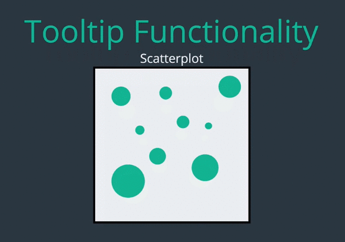
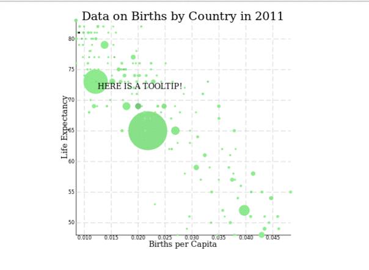
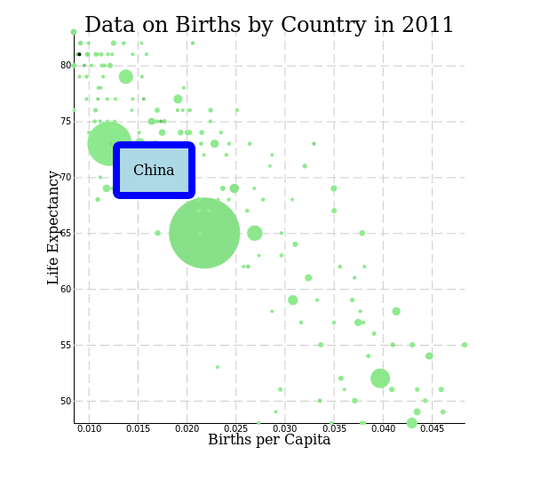
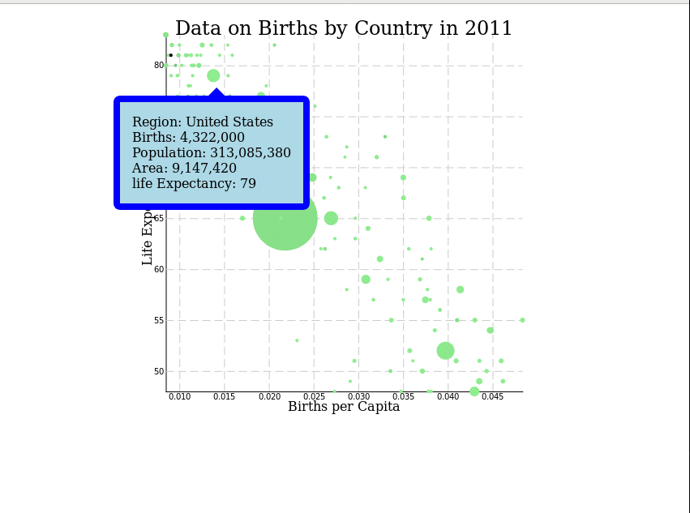

22, July 2018 Sun 17:31

## D3 Odds and Ends | Objectives

    1. Define what a tooltip is.
    2. Build tooltips to improve the readability of visualization.
    3. Use D3 transition to animate our graphs.
    4. Explain the D3 transition events.
    6. Use AJAX in D3 to import and format data from external sources.
    7. Use d3.queue to chain multiple request together.

### Tooltips

In early lecture we build **Scatterplot** and include **axes** and **label**
to clarify what exactly what we graph in. What I like to do now is make it when
I hover over any one this circle a **box** appear with more detail information on
a country. This boxes typically call a **tooltips**.

D3 doesn't come much with built in functionality to create tooltips, and while there
tooltips library out there, isn't that hard to create a tooltip from scratch,
before we start coding thought, lest think about what functionality about tooltips
to have. We probably need to create a **div** that isn't invisible until the user
hover it over the circle on the scatterplot, when the user hovers we need move
our tooltip so that is near the circle and update is content base on the data, then
when the user move away from the circle we need hide the tooltip again.

We can implement this functionality with D3 and a bit of CSS, to begin we use D3
to append **div** to the page with the class of **tooltip**, I can write style
and rule in JavaScript to, but I need set a quit few properties.

    var tooltip = d3.select("body")
                    .append("div")
                    .classed("tooltip", true);

So I just create some CSS instead, Well continue to add style as we go, for now
the most important thing is that to set the **opacity** to **0**, and we give
our tooltips **absolute** positioning. The absolute positioning well let us
control where the **div** shows up base on where we place our mouse.

    .tooltip {
      opacity: 0;
      position: absolute;
    }

Next, lets write some code that will update the tooltip when the mouse is hover
over data-point, for this I need to select all circle elements and then I attach
listener for mouse movement, when this event is triggered I take my tooltip
selection, set the **opacity** to **1** and update the text, for now I wouldn't
worrying to display any data, I just hard code the **string** to make sure
something showing up. What about location of tooltip? for this I can set
**left** and **top** property of the **div** base on the event. I use **x** and
**y** properties on D3 event here, which give me the coordinate of the mouse
position. I also need to specify what my units are, in this case there are
**pixels**.

    d3.select("svg")
        .attr("width", width)
        .attr("height", height)
      .selectAll("circle")
      .data(birthData2011)
      .enter()
      .append("circle")
        .attr("cx", d => xScale(d.births / d.population))
        .attr("cy", d => yScale(d.lifeExpectancy))
        .attr("fill", d => colorScale(d.population / d.area))
        .attr("r", d => radiusScale(d.births))
        .on("mousemove", function() {               << add this line
          tooltip
            .style("opacity", 1)
            .style("left", d3.event.x + "px")
            .style("top", d3.event.y + "px")
            .text("HERE IS A TOOLTIP!");
        })
        .on("mouseout", function() {
          tooltip
            .style("opacity", 0);
        });

While I'm here I also add eventListener when I mouse out of the circle, this
eventListener will be pretty simple, I just add tooltip **opacity** back to
**0**. When I refresh the page I see tooltip is working.

Well the tooltip shows up but there's flickering annoying, The problem is, as
soon I mouse over it the circle, the tooltip move to the location of my pointer
causing my pointer to mouse over the tooltip out of the circle. As soon my
tooltip become visible it's become invisible again. The easy way to fix this,
set **pointer-event** to **none** for my tooltip in the CSS. This basically tells
my mouse to ignore the tooltip entirely, so the motion of the tooltip doesn't
cost the mouse out of identifier on the circle. While I'm modifying the CSS lets
style he tooltip little bit more.

I added **background-color, border, border-radius and padding**

    .tooltip {
      opacity: 0;
      position: absolute;
      pointer-events: none;
      background-color: lightblue;
      border: 8px solid blue;
      border-radius: 8px;
      padding: 15px;
    }

Next, lets update the text so that actually show a data the current region. To
do this we need to pass the circle data into our mouse over the callback.

        .on("mousemove", function(d) {
          tooltip
            .style("opacity", 1)
            .style("left", d3.event.x + "px")
            .style("top", d3.event.y + "px")
            .text(d.region);
        })
        .on("mouseout", function() {  << give the name of region showup.
          tooltip
            .style("opacity", 0);
        });

Since that working lest update what we display to show even more data on that
region, now I want to show everything, the **name of the region**, the
**birth**, the **total population**, the **land area**, and the **life expectancy**.
That a lot of data to be storing, so rather then create a long string of text,
I set HTML instead. I use ES2015 template string to make the process creating this
HTML easier, otherwise it's involve a lot of nested appends or a lot of concatenate
string either way the code have little hard to read. This way I can see the
structure of HTML very easily.

    .on("mousemove", function(d) {
      tooltip
        .style("opacity", 1)
        .style("left", d3.event.x + "px")
        .style("top", d3.event.y + "px")
        .text(d.region);
        .html(`
          
Region: ${d.region}

          
Births: ${d.births}

          
Population: $}d.population}

          
Are: ${d.area}

          
life Expectancy: ${d.lifeExpectancy}

        `);
      })

I also style **p** tag little bit, so that there less space between them.

    .tooltip p {
      margin: 0;
    }

There is a small issue, some of region have longest number of population make it
so hard to read, so I have to format this number to be more readable, D3 has
formatting helpers, but to keep this thing simple for now I just use the build-in
to look out string method in javaScript, which convert a number to more readable
version of that number.

      .html(`
        
Region: ${d.region}

        
Births: ${d.births.toLocaleString}

        
Population: ${d.population.toLocaleString}

        
Area: ${d.area.toLocaleString}

        
life Expectancy: ${d.lifeExpectancy}

      `);

Next I need to center the tooltip base on my mouse position rather then having
all the way to the right, I do this by changing a **left** property so it's
count for the width of the div. To access the div using D3 I call **node** on
my tooltip variable and then access it's width. I **ofsettWidth** property by
half the width of my tooltip and well I'm here I also move the tooltip down
a bit.

      tooltip
        .style("opacity", 1)
        .style("left", d3.event.x -(tooltip.node().offsetWidth / 2) + "px")
        .style("top", d3.event.y + 25 + "px")
        .text(d.region);

One last little styling flourish DIY, is see with tooltip, involving adding
a triangle on the side base on the mouse so the tooltip like a speech bubble.
There are of number you can do this with CSS but we do it using the **before**
sudo element we can create the triangle by setting the border on this element to
be transparent, but then setting a different color for the bottom border. To see
this element in entirety lets give a visible background color.

    .tooltip:before {
      content: ' ';
      position: absolute;
      border: 12px solid red;
      top: -30px;
      left: 50%;
      margin-left: -6px;
    }

As you can see the border bottom setting only impact the bottom part the
element, now lets set the border to transparent.

    border: 12px solid transparent;

One last important thing to note, there are tooltip wouldn't work on mobile,
that because touch event different from mouse events, so the mouse event won't
prior the phone or tablet. To fix this we can simply pull out our callback outs
into name call function and then add them as eventListener to both mouse event
and touch event. The touch event will listen for **touchstart** and **touchend**

    d3.select("svg")
        .attr("width", width)
        .attr("height", height)
      .selectAll("circle")
      .data(birthData2011)
      .enter()
      .append("circle")
        .attr("cx", d => xScale(d.births / d.population))
        .attr("cy", d => yScale(d.lifeExpectancy))
        .attr("fill", d => colorScale(d.population / d.area))
        .attr("r", d => radiusScale(d.births))
        .on("mousemove", showTooltip)
        .on("touchstart", showTooltip)
        .on("mouseout", showTooltip)
        .on("touchend", showTooltip);

    function showTooltip(d) {
      tooltip
        .style("opacity", 1)
        .style("left", d3.event.x -(tooltip.node().offsetWidth / 2) + "px")
        .style("top", d3.event.y + 25 + "px")
        .text(d.region)
        .html(`
          
Region: ${d.region}

          
Births: ${d.births.toLocaleString()}

          
Population: ${d.population.toLocaleString()}

          
Area: ${d.area.tolocalestring()}

          
life Expectancy: ${d.lifeExpectancy}

        `);
    }

    function hideTooltip() {
      tooltip
        .style("opacity", 0);
    }

